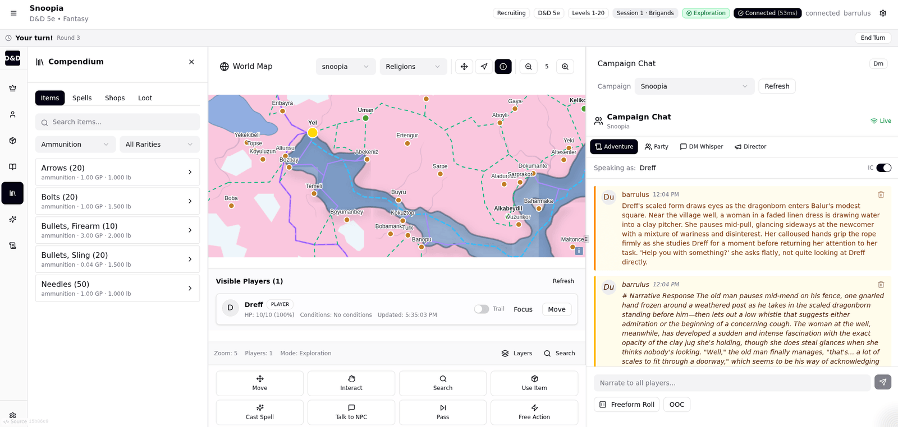
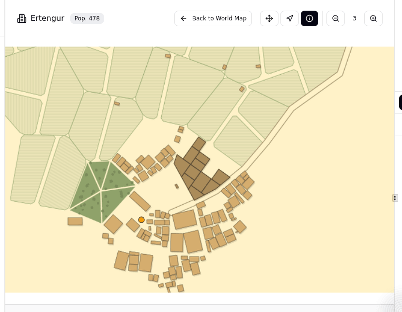
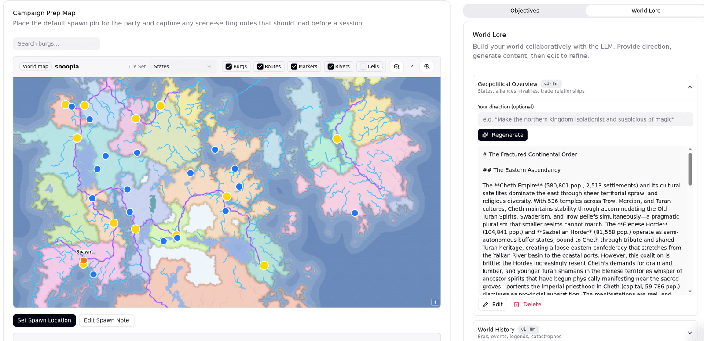
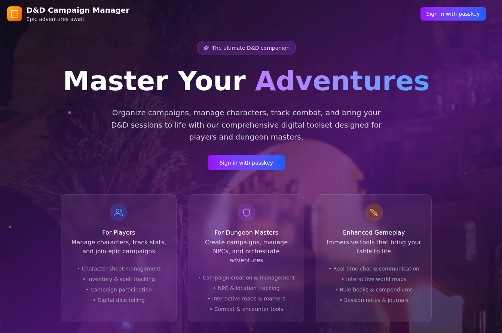

# Questables

A multiplayer D&D 5e platform where **the LLM runs the game**. Players declare actions, the
model narrates outcomes and drives NPCs and enemies, and the human "Campaign Director" shapes
the world rather than adjudicating every roll.

The world itself is real spatial data: maps imported from [Azgaar's Fantasy Map
Generator](https://azgaar.github.io/Fantasy-Map-Generator/) are stored in PostGIS and rendered
with OpenLayers, so burgs, routes, rivers, and biomes are queryable geometry rather than
decoration.



*A live session. The turn banner tracks whose turn it is, the action grid is how a player declares
intent, and the narration in the chat panel is the LLM responding in character as the DM.*

> **Status:** actively developed, single-operator project. There is no demo mode and no hosted
> instance — a working PostgreSQL + PostGIS database is mandatory, and narrative features need a
> reachable LLM provider.

---

## What it does

**Autonomous DM.** Player actions POST to the backend and return immediately; the LLM call runs
async and its result is broadcast over WebSocket. Responses are constrained by a JSON schema
(narration, mechanical outcome, required rolls, phase transitions), so the model's output feeds
the game state machine directly instead of being free prose someone has to interpret.

**Server-authoritative game state.** Phase (exploration / combat / social / rest) and turn order
live on the session row, mutated under `SELECT FOR UPDATE` and written to an audit table. Mutable
per-session character state (HP, conditions, hit dice, death saves) shadows the character sheet in
`session_live_states` so a session never corrupts the canonical character.

**Full 5e loop.** Character creation wizard, combat with LLM-controlled enemy turns, death saves,
short/long rests, levelling with XP thresholds, NPC shops, and weighted loot tables — all backed by
SRD data imported from Open5e (2014 and 2024 documents).

**World mapping.** Pixel-space projection (SRID 0) preserving FMG coordinates, viewport-driven
layer loading, burg entrance gates and settlement maps supplied by the external `settlemaker`
generator, coastline-aware harbours, and narrative travel between locations with computed travel
times.



*Walk into a burg and the world map gives way to its streets — generated by `settlemaker` from the
settlement's own population and terrain, not drawn by hand.*

**World building.** A cascading LLM pipeline where each step feeds the next, plus lore capture,
scene-scoped context assembly, and hallucination guards that keep generated content anchored to
what the database actually says.



*Campaign preparation. The Campaign Director gives direction — "make the northern kingdom
isolationist and suspicious of magic" — and the pipeline generates lore from the actual map data:
real state names, real populations, real settlement counts. Every section is versioned and
editable.*

**Operations.** JWT auth with bcrypt, WebAuthn passkeys, AES-256-GCM encryption of user PII,
role-based access (`player` / `dm` / `admin`), rate limiting, moderation endpoints, and an admin
dashboard surfacing LLM request metrics, provider health, and cache governance.

---

## Tech stack

| Layer | Technology |
|-------|------------|
| Frontend | React 19, TypeScript, Vite 7, Tailwind CSS v4 |
| UI | Radix UI primitives (ShadCN conventions) |
| Mapping | OpenLayers 10 with a custom `QUESTABLES_PIXEL` projection |
| Backend | Express 5 (Node.js, ESM) |
| Database | PostgreSQL 17 + PostGIS + CITEXT |
| Real-time | Socket.io |
| LLM | Ollama by default, behind a provider registry |
| Testing | Jest 30, React Testing Library, Supertest |

---

## Quick start

### Prerequisites

- Node.js 20+ (the Nix dev shell pins 24)
- PostgreSQL 17 with the `postgis`, `citext`, and `uuid-ossp` extensions available
- Ollama or another configured LLM provider (required for any narrative feature)

A `flake.nix` is provided: `nix develop` drops you into a shell with Node and the Postgres client.

### Setup

```bash
git clone <repository-url>
cd questables
npm install                 # postinstall also installs server/ dependencies

createdb dnd_app
psql -d dnd_app -c "CREATE EXTENSION IF NOT EXISTS postgis;"
psql -d dnd_app -c "CREATE EXTENSION IF NOT EXISTS citext;"

cp .env.example .env
$EDITOR .env                # database credentials, ENCRYPTION_KEY, LLM host

npm run db:setup            # applies database/schema.sql, seeds the admin user
npm run dev:local           # frontend + backend together
```

- Frontend: <http://localhost:3000>
- Backend API: <http://localhost:5101>
- Health: <http://localhost:5101/api/health>



Sign-in is WebAuthn passkeys — there are no demo accounts, so the first account comes from
`npm run db:setup` seeding an admin.

The Vite dev server proxies `/api` and `/socket.io` to the backend, so the frontend makes
same-origin requests and needs no API URL of its own.

### Schema and migrations

`database/schema.sql` is the **final-state** schema and is re-applied idempotently by
`server/setup-database.js` on every server start — that is what a fresh install gets.
`database/migrations/*.sql` roll an *existing* database forward and are applied manually:

```bash
psql -d dnd_app -f database/migrations/017_fmg_full_json_schema_indexes.sql
```

Each migration ships a matching `.rollback.sql`. When a migration adds a table or column, the same
shape must be folded into `schema.sql` — the two are expected to stay in sync.

### SRD data

```bash
cd server
npm run import-srd          # both document sets
npm run import-srd:2014     # or a single one
npm run import-srd:2024
```

---

## Configuration

All configuration is environment-based; see `.env.example` for the annotated list. The essentials:

```env
# Database
DATABASE_HOST=localhost
DATABASE_PORT=5432
DATABASE_NAME=dnd_app
DATABASE_USER=your_username
DATABASE_PASSWORD=your_password
DATABASE_SSL=false
# or a single DATABASE_URL=postgresql://...

# PII encryption (AES-256-GCM) — 32 hex-encoded random bytes: openssl rand -hex 32
# Rotating or losing this key invalidates every encrypted field.
ENCRYPTION_KEY=

# WebAuthn / passkeys — RP_ID is a bare registrable domain, ORIGIN must match the browser exactly
WEBAUTHN_RP_NAME=Questables
WEBAUTHN_RP_ID=localhost
WEBAUTHN_ORIGIN=http://localhost:3000

# Server
DATABASE_SERVER_PORT=5101
FRONTEND_URL=http://localhost:3000

# LLM provider
LLM_PROVIDER=ollama
LLM_OLLAMA_HOST=http://localhost:11434
LLM_OLLAMA_MODEL=qwen3:8b
```

Optional TLS (`DATABASE_SERVER_USE_TLS`, `DEV_SERVER_USE_TLS` and their cert/key paths), debug
logging, and health-check tuning are documented inline in `.env.example`.

Providers can also be registered in the `llm_providers` table so they are selectable at runtime;
`GET /api/admin/llm/providers` reports each one's health. The backend refuses to serve narrative
requests when provider bootstrap fails — there is no fallback prose.

---

## Repository layout

```
├── App.tsx, main.tsx        # Frontend entry
├── components/
│   ├── ui/                  # Radix/ShadCN primitives — no business logic
│   ├── layers/              # OpenLayers layer factories
│   ├── maps/                # Style factories, tooltips, tile sources
│   ├── character-wizard/    # 7-step creation flow
│   ├── action-panel/        # Player action declaration, rolls, rests, death saves
│   ├── game-state/          # Phase indicator, turn banner
│   ├── compendium/          # SRD browser, shops, loot tables
│   └── live-state/          # Session-scoped HP/conditions UI
├── contexts/                # User, GameSession, GameState, Action, LiveState
├── hooks/, utils/, shared/  # Client helpers, API client, SRD types
├── server/
│   ├── database-server.js   # Express entry point
│   ├── websocket-server.js  # Socket.io
│   ├── routes/              # 22 domain route modules
│   ├── services/            # Business logic (game-state, combat, dm-action, …)
│   ├── llm/                 # Provider registry, schemas, context builders
│   ├── db/, validation/     # Pool, input validation
│   └── scripts/             # SRD import, admin enrolment, backfills, smoke tests
├── database/
│   ├── schema.sql           # Final-state schema (idempotent)
│   └── migrations/          # Forward + rollback pairs
├── tests/                   # Jest suites, grouped by domain
└── docs/                    # Architecture and subsystem guides
```

---

## Commands

| Command | Description |
|---------|-------------|
| `npm run dev` | Vite dev server only (port 3000) |
| `npm run db:server` | Express backend only (port 5101) |
| `npm run db:dev` | Backend with nodemon reload |
| `npm run dev:local` | Both, concurrently |
| `npm run db:setup` | Install server deps, apply schema, seed admin |
| `npm run build` | `tsc` type check + Vite production build |
| `npm run lint` | ESLint, zero warnings tolerated |
| `npm test` | Jest suite |
| `npm run test:watch` / `test:coverage` / `test:ci` | Jest variants |
| `npx tsc --noEmit` | Type check without building |

---

## Testing

Tests live in `tests/`, grouped by domain (`llm/`, `maps/`, `movement/`, `security/`,
`settlemaker/`, `world-building/`, `plan3b/`, `shared/`, with fixtures in `fixtures/`).

```bash
npm test
npm test -- --runTestsByPath tests/movement/travel-planner.test.js
npm test -- tests/maps                       # a whole domain
```

Database-backed suites (the FMG full-JSON ingesters, movement gate integration) skip themselves
unless connection details are present, then run inside a transaction that is rolled back:

```bash
PGUSER=$USER PGDATABASE=dnd_app npm test -- tests/maps/fmg-full-json
```

Some suites additionally take `TEST_CAMPAIGN_ID`, `TEST_SESSION_ID`, `TEST_BURG_ID`, and
`TEST_ACTING_CHAR_ID` to target real rows in a seeded database.

Run `npx tsc --noEmit` before committing — Vite's dev server does not type check.

---

## Deployment

Production runs on the NixOS host `rucio`, configured in the separate `quixote` repo
(`modules/services/questables.nix`, `hosts/rucio/`) and deployed with **deploy-rs**. Secrets are
managed with agenix. There is no CI deploy pipeline.

```bash
# from the quixote checkout
nix flake update settlemaker-src   # settlemaker first — the server links it
nix flake update questables-src
deploy .#rucio
```

The NixOS module builds frontend and server as separate derivations and symlinks the
independently-built settlemaker store path into the server's `node_modules`, so the
`file:../settlemaker` path dependency used in development plays no part in a deployed build.

The build-time `VITE_SOURCE_URL` / `VITE_SOURCE_REVISION` values described under
[License](#license) must be supplied by that module, since Vite freezes them into the bundle
during `npm run build` and they cannot be changed at runtime.

---

## Documentation

Subsystem guides live in [`docs/`](./docs/README.md):

| Document | Covers |
|----------|--------|
| [Architecture](./docs/architecture.md) | System overview, request pipeline, key decisions |
| [Database Schema](./docs/database-schema.md) | Tables, relationships, indexes |
| [Frontend Guide](./docs/frontend-guide.md) | Components, contexts, UI patterns |
| [Mapping System](./docs/mapping-system.md) | OpenLayers, projections, PostGIS layers |
| [Character Wizard](./docs/character-wizard.md) | Creation flow and state machine |
| [LLM Integration](./docs/llm-integration.md) | Providers, prompting, caching |
| [WebSocket Events](./docs/websocket-events.md) | Socket.io event reference |
| [User Journeys](./docs/user-journeys.md) | UI inventory and navigation |
| [Development Guide](./docs/development-guide.md) | Setup, conventions, troubleshooting |

Design specs and implementation plans are archived under `docs/superpowers/`.

---

## Troubleshooting

```bash
pg_isready                                              # Postgres up?
psql -d dnd_app -c "SELECT PostGIS_version();"          # PostGIS installed?
curl http://localhost:5101/api/health                   # backend + pool stats
curl http://localhost:11434/api/tags                    # Ollama reachable?
rm -rf node_modules/.vite                               # clear stale Vite cache
```

- **Blank map** — check the `tile_sets` table and the configured tile source.
- **Layers silently empty** — `MapDataLoader` methods rely on `this`; pass them as arrow wrappers,
  not bare references.
- **Stale map tooltips** — event handlers must be stable refs, not inline closures.

---

## License

Questables is licensed under the **GNU Affero General Public License version 3**, and only that
version (`AGPL-3.0-only`). See [LICENSE](./LICENSE) for the full text and [NOTICE](./NOTICE) for
the provenance chain.

The AGPL is chosen deliberately. Questables is a network application, and §13 requires that anyone
who runs a **modified** version as a service — publicly or otherwise — offers its users the
corresponding source. Forks are welcome; forks that stay closed are not.

**If you deploy a modified Questables,** set `VITE_SOURCE_URL` to your own repository at build
time (and ideally `VITE_SOURCE_REVISION` to the commit). The app renders a permanent "Source" link
from this; pointing it at upstream does not satisfy §13, because upstream is not the code your
users are running.

**Why "only" and not "or later":** Questables links `settlemaker` into the server at runtime, and
settlemaker is `GPL-3.0-only` — because *its* upstream, watabou's TownGeneratorOS, publishes no
"or later" grant. GPLv3 §13 permits combining a GPLv3 work with **version 3** of the AGPL
specifically; a later AGPL version carries no such permission. Offering Questables under "AGPL-3.0
or later" would therefore promise something the combined work cannot deliver. The restriction
propagates from watabou down, and Questables matches it rather than overreaching.

## Contributing

See [CONTRIBUTING.md](./CONTRIBUTING.md). In short: there is no CLA, you keep copyright in your own
work, and every commit must be signed off under the Developer Certificate of Origin —
`git commit -s`.

## Attribution

This work includes material taken from the System Reference Document 5.1 ("SRD 5.1") by Wizards of
the Coast LLC and available at
<https://dnd.wizards.com/resources/systems-reference-document>. The SRD 5.1 is licensed under the
Creative Commons Attribution 4.0 International License, available at
<https://creativecommons.org/licenses/by/4.0/legalcode>.

This work includes material taken from the System Reference Document 5.2 ("SRD 5.2") by Wizards of
the Coast LLC and available at <https://www.dndbeyond.com/srd>. The SRD 5.2 is licensed under the
Creative Commons Attribution 4.0 International License, available at
<https://creativecommons.org/licenses/by/4.0/legalcode>.

Questables is not affiliated with, endorsed by, or sponsored by Wizards of the Coast. Only openly
licensed SRD material is included — no content from published rulebooks.

## Acknowledgments

- [Azgaar's Fantasy Map Generator](https://azgaar.github.io/Fantasy-Map-Generator/) — world map source
- [settlemaker](https://github.com/barrulus/settlemaker) — settlement maps, a TypeScript port of
  [watabou's Medieval Fantasy City Generator](https://watabou.itch.io/medieval-fantasy-city-generator)
- [Open5e](https://open5e.com/) — SRD data API
- [OpenLayers](https://openlayers.org/), [Radix UI](https://www.radix-ui.com/), [Ollama](https://ollama.com/)
