# D&D Game Process Flow — LLM Dungeon Master System

> **Purpose:** This document defines the complete process flow for a multiplayer D&D game powered by a local LLM acting as Dungeon Master. It is intended as a specification for a Claude Code agent to implement and refine game logic, state management, and DM behaviour.

---

## 1. High-Level Game Loop

The game operates as an infinite session loop cycling through three core phases. The DM (LLM) orchestrates transitions between phases based on player actions and world state.

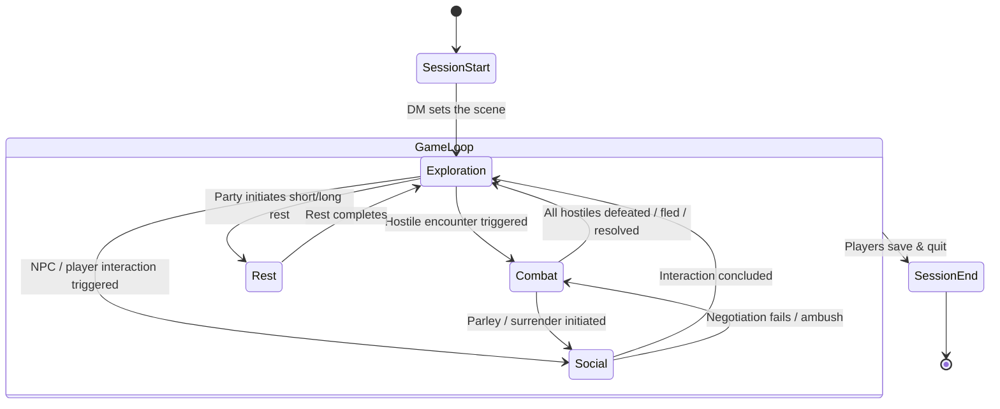

### Phase Definitions

| Phase | Description | DM Responsibilities |
|---|---|---|
| **Exploration** | Players move on the map, investigate, loot, and interact with the environment. | Narrate surroundings, reveal map fog-of-war, describe points of interest, handle perception/investigation checks, trigger encounters. |
| **Combat** | Turn-based tactical engagement with hostile entities. | Control all enemy/NPC actions, adjudicate rules, narrate outcomes, track enemy HP/status. |
| **Social** | Dialogue-driven interaction with NPCs, shops, quest-givers, or between players with DM mediation. | Roleplay NPCs, adjudicate persuasion/deception/intimidation checks, manage trade and quest logic. |
| **Rest** | Short or long rest to recover resources. | Enforce rest rules, narrate passage of time, roll for random encounters during long rests, apply recovery effects. |

---

## 2. Session Start Flow

This runs once when the game begins or a saved session is loaded.

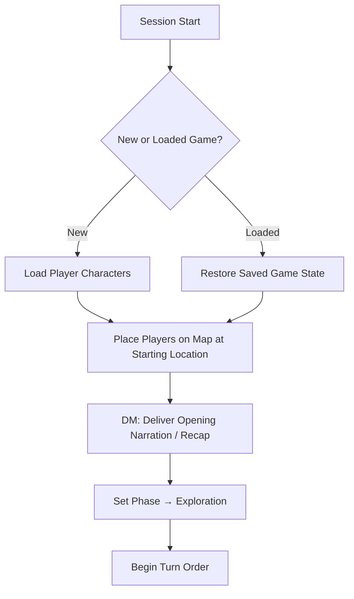

### Game State to Restore/Initialise

- Player positions on map
- Player inventories, spell slots, HP, conditions
- Active quests and flags
- Map fog-of-war state
- NPC states and dispositions
- Current phase and turn order

---

## 3. Exploration Phase

Exploration is the default phase. Players act in **round-robin turn order** (not initiative — that is reserved for combat). Each player takes a turn, then the DM processes the world.

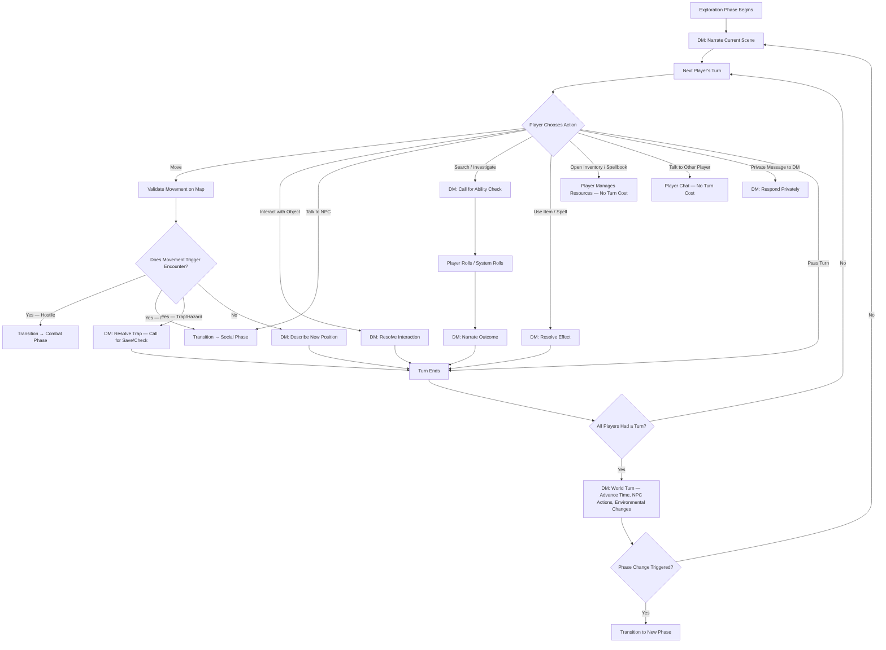

### Key Rules for Exploration

- **Free actions** (no turn cost): opening inventory, reading spellbook, player-to-player chat, checking stats.
- **Turn actions** (consume the player's turn): move, interact, search, use item/spell, talk to NPC.
- **DM world turn**: after all players have acted, the DM advances world state — NPC patrols move, torches dim, time passes, wandering monster checks occur.
- **Encounter triggers** are defined on the map (fixed) or rolled randomly by the DM (wandering).

---

## 4. Combat Phase

Combat uses standard D&D turn-based rules: initiative order, action economy, and round structure.

### 4.1 Combat Initiation

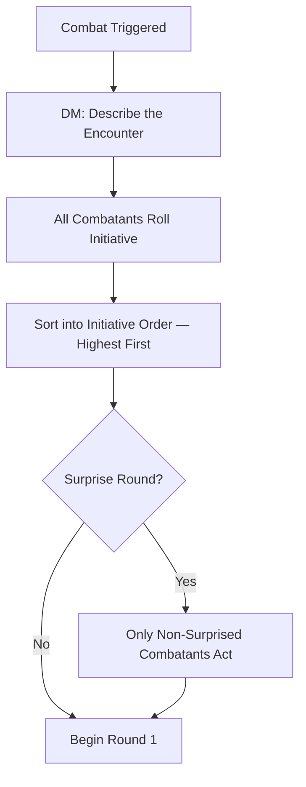

### 4.2 Combat Round Loop

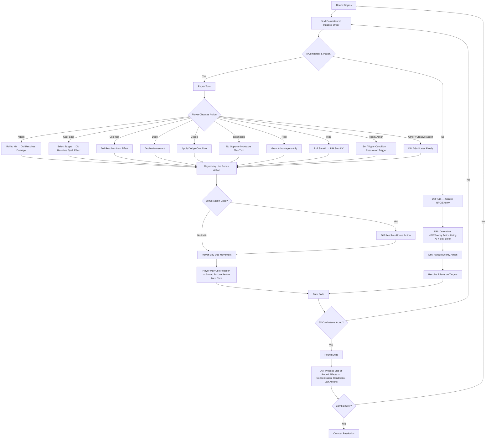

### 4.3 Combat Resolution

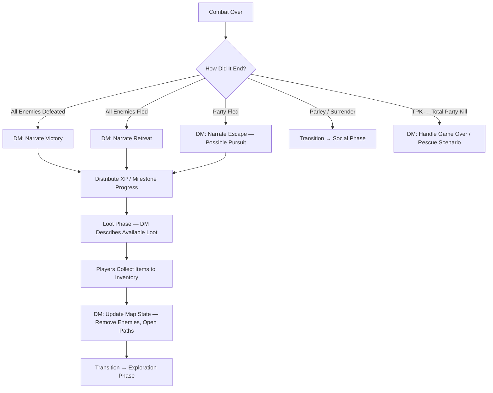

### 4.4 Player Action Economy Per Turn (Reference)

| Component | Count | Examples |
|---|---|---|
| **Action** | 1 | Attack, Cast a Spell, Dash, Dodge, Disengage, Help, Hide, Use Object, Ready |
| **Bonus Action** | 0–1 | Offhand attack, certain spells (Healing Word, Misty Step), class features (Cunning Action) |
| **Movement** | Up to speed | Can be split before/after action. Difficult terrain costs double. |
| **Reaction** | 0–1 (before next turn) | Opportunity attack, Shield spell, Counterspell, class features |
| **Free Interaction** | 1 | Draw/sheathe weapon, open door, speak a short phrase |

---

## 5. Social Phase

Social interactions are primarily driven by the LLM roleplaying NPCs.

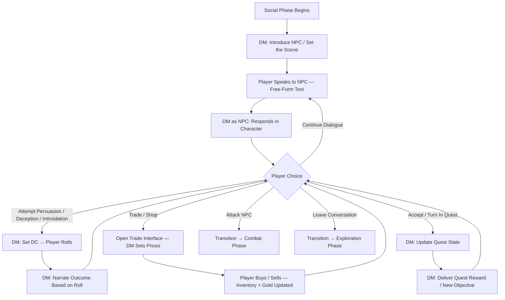

### DM Behaviour During Social Phase

- The LLM should maintain a **consistent NPC personality** across interactions (use NPC state/memory).
- NPC disposition can shift based on player actions (friendly → hostile if insulted).
- **Insight checks** can be requested by players to detect NPC lies or motivations.
- Group conversations: multiple players can participate; the DM should address them naturally.

---

## 6. Rest Phase

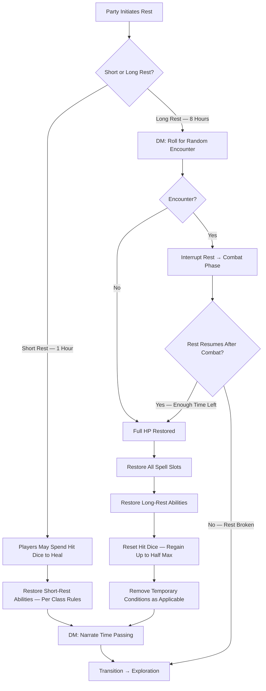

---

## 7. Communication System

Communication is a core pillar. There are four distinct channels.

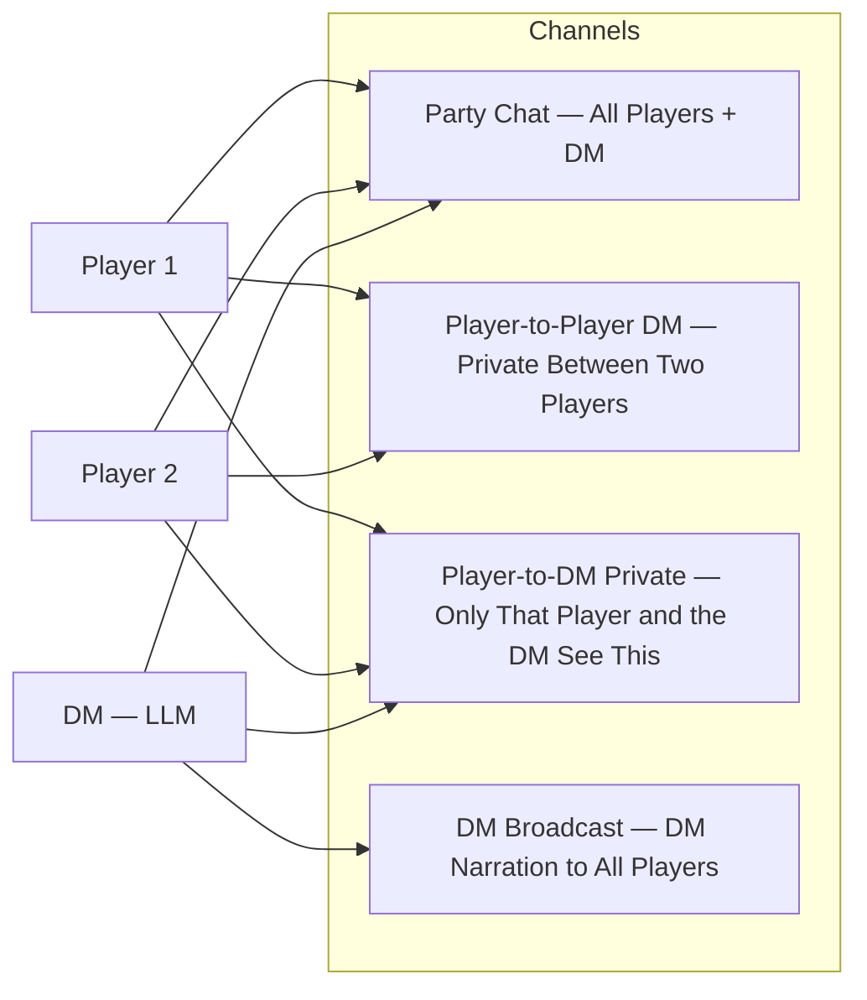

### Channel Rules

| Channel | Participants | Turn Cost | Use Cases |
|---|---|---|---|
| **Party Chat** | All players + DM | None | Strategy, banter, group decisions |
| **Player ↔ Player Private** | Two specific players | None | Secret plans, RP between characters, passing items covertly |
| **Player → DM Private** | One player + DM only | None | Ask rules questions, declare secret actions (e.g. "I secretly palm the gem"), request hidden rolls |
| **DM Broadcast** | DM → all players | N/A | Scene narration, combat descriptions, world events, announcements |

### DM Private Message Behaviour

When a player sends a private message to the DM, the LLM should:

1. **Rules questions**: Answer factually without narrative flavour. Do not reveal the answer to other players.
2. **Secret actions**: Acknowledge, resolve silently (make any required rolls), and only narrate the visible outcome to the group. Example: Player privately says "I try to pickpocket the merchant." → DM privately responds with the Sleight of Hand result. If successful, group sees nothing. If failed, DM narrates to group that the merchant notices.
3. **Meta questions**: ("What are my options?", "Can I do X?") Answer helpfully. This is analogous to a player whispering to the DM at a real table.

---

## 8. DM Decision Flow — How the LLM Should Process Any Player Action

This is the core logic the LLM follows every time a player declares any action.

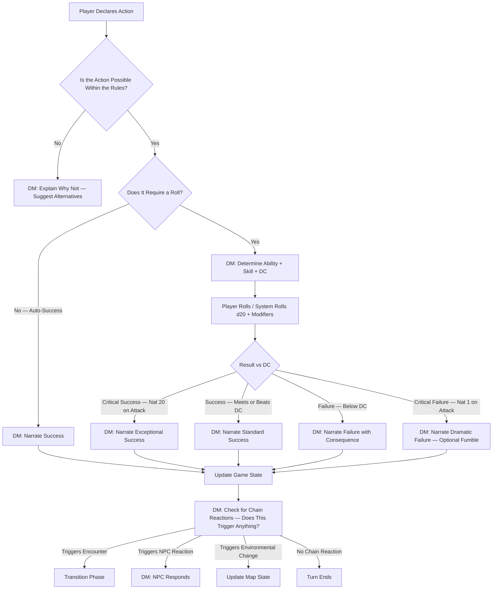

---

## 9. Player State Model

Each player has a persistent state object the system must track.

```
Player {
    // Identity
    name: string
    class: string
    race: string
    level: int
    xp: int
    alignment: string

    // Core Stats
    abilities: { STR, DEX, CON, INT, WIS, CHA }  // Each 1–20+
    proficiency_bonus: int
    armor_class: int
    hit_points: { current, max, temporary }
    hit_dice: { current, max, die_type }
    speed: int
    
    // Position
    map_position: { x, y }
    
    // Resources
    spell_slots: { level_1: {current, max}, ... level_9: {current, max} }
    class_resources: { ... }  // Ki points, rage uses, sorcery points, etc.
    gold: int
    
    // Collections
    inventory: [ { item, quantity, equipped } ]
    spellbook: [ { spell, level, prepared } ]   // Known/prepared spells
    conditions: [ { condition, duration, source } ]  // Poisoned, prone, etc.
    
    // Social
    active_quests: [ { quest_id, stage } ]
    npc_dispositions: { npc_id: attitude }  // Tracks relationship with NPCs
}
```

---

## 10. Levelling Up

Levelling happens outside of the core game loop but must be handled.

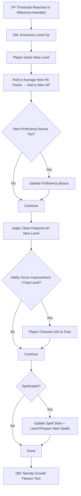

---

## 11. Death and Dying

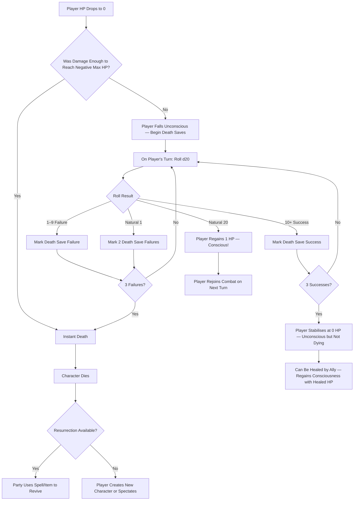

### External Interrupts During Death Saves

- **Taking damage while at 0 HP** = automatic death save failure (2 failures if critical hit).
- **Receiving healing while at 0 HP** = regain consciousness with healed HP amount, death saves reset.
- **Stabilised** characters regain 1 HP after 1d4 hours unless healed sooner.

---

## 12. Complete Turn Sequence Summary

This is the atomic unit of gameplay. Every player turn follows this sequence.

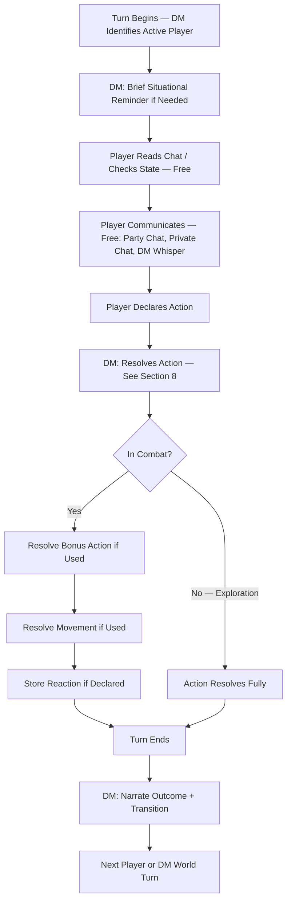

---

## 13. Phase Transition Reference

| From | To | Trigger |
|---|---|---|
| Exploration → Combat | Hostile creature detected, trap triggers attack, player attacks NPC |
| Exploration → Social | Player initiates dialogue with NPC, enters shop, triggers cutscene |
| Exploration → Rest | Party unanimously agrees to rest in a safe-enough location |
| Combat → Exploration | All hostiles defeated, fled, or otherwise resolved |
| Combat → Social | Combatant(s) attempt parley, surrender is offered/accepted |
| Social → Exploration | Conversation ends, player leaves dialogue |
| Social → Combat | NPC turns hostile, negotiation fails catastrophically, ambush |
| Rest → Exploration | Rest completes without interruption |
| Rest → Combat | Random encounter interrupts rest |

---

## 14. Implementation Notes for the LLM DM

### Context the LLM Needs Per Request

Every time the LLM is prompted for a DM response, it should receive:

1. **Current phase** (exploration / combat / social / rest)
2. **Active player** (whose turn it is)
3. **Player action** (what they declared)
4. **Relevant player state** (HP, conditions, position, inventory excerpt)
5. **Scene context** (current room/area description, visible NPCs/enemies)
6. **Combat state** (if in combat: initiative order, enemy HP/conditions, round number)
7. **Recent narration history** (last N messages for continuity)
8. **NPC memory/state** (if in social: who they're talking to, disposition, conversation so far)

### LLM Response Format

The LLM should return structured output containing:

- **narration**: Flavour text to display to all players (or privately if applicable)
- **mechanical_outcome**: Structured data — damage dealt, HP changes, conditions applied/removed, items gained/lost
- **required_rolls**: Any rolls the system needs to prompt for
- **state_changes**: Updates to apply to game state
- **phase_transition**: If the phase should change, and to what
- **private_messages**: Any messages that should only go to specific players

### Tone Guidelines

- Narration should be vivid but concise — players want to act, not read novels.
- Combat narration should emphasise impact and stakes.
- Failed actions should still feel like something happened, not just "you fail."
- The DM should never directly say dice results in narration — weave them into the story.
