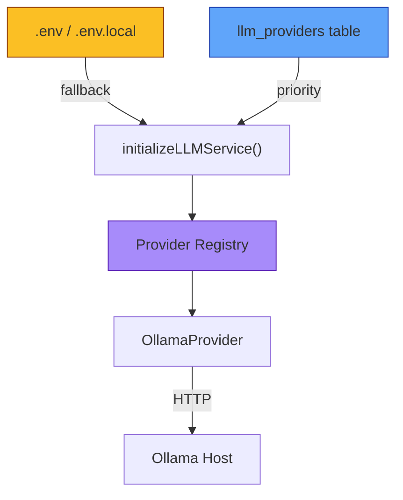
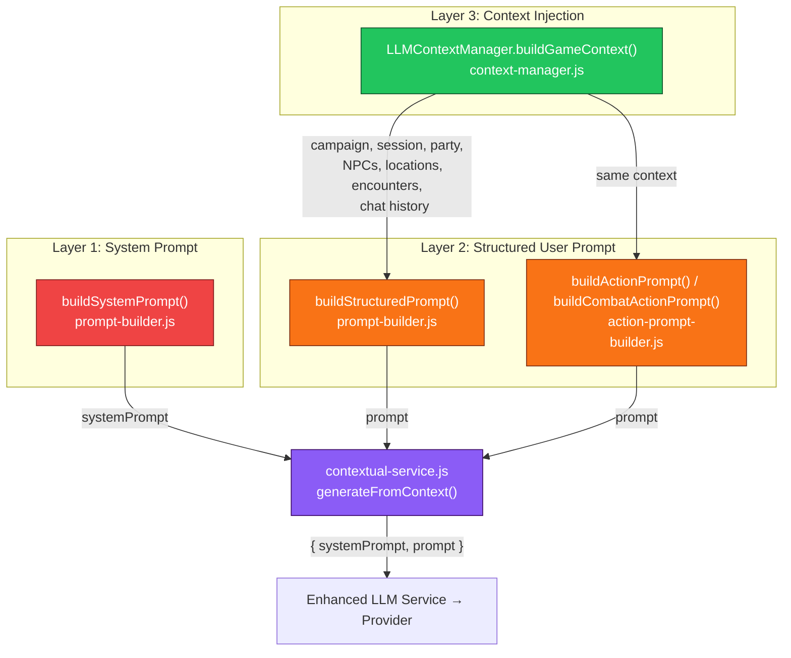
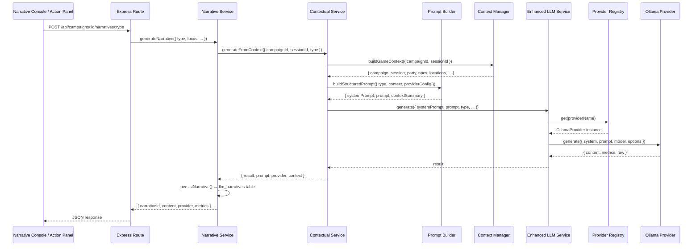
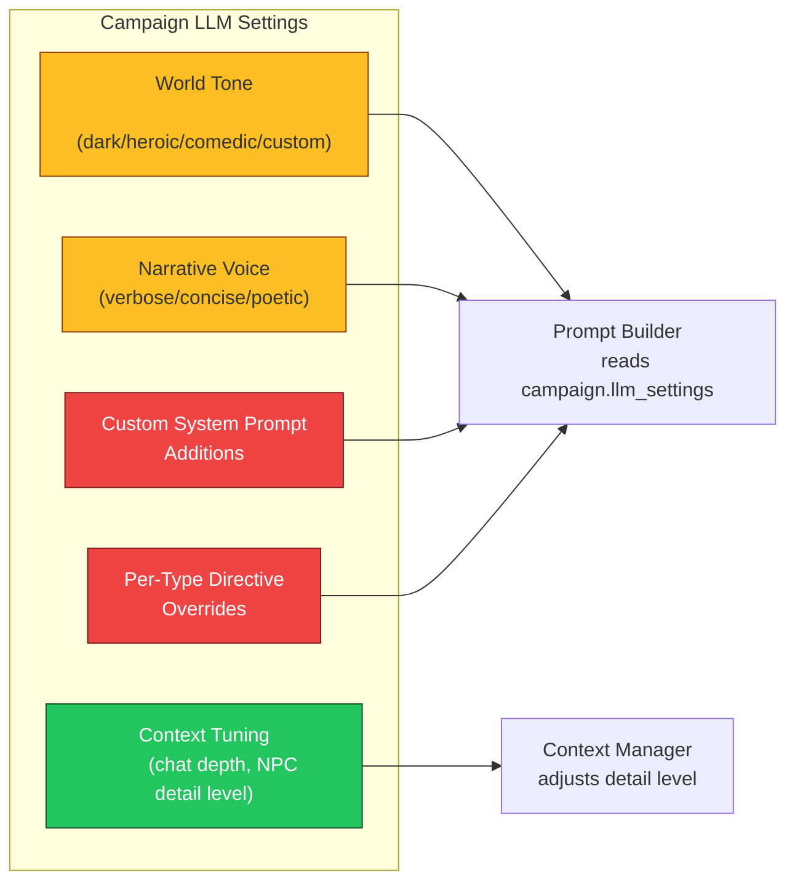

# Questables LLM System Analysis

## Current State Summary

The LLM subsystem is architecturally solid — provider-abstracted, context-enriched, with metrics, caching, and persistence. However, **all prompt templates and system prompts are hardcoded in server-side JavaScript**, and **there is no UI for configuring the LLM provider, editing prompts, or tuning generation parameters**. The only configuration surfaces today are `.env` files, raw SQL inserts, and the Admin dashboard's read-only LLM Workloads tab.

This document maps the full system and identifies exactly what needs to change to give DMs runtime control over LLM behaviour.

---

## Provider Configuration

### How It Works Today



**Environment variables** (`.env.local`):

| Variable | Default | Purpose |
|---|---|---|
| `LLM_PROVIDER` | `ollama` | Active adapter name |
| `LLM_OLLAMA_HOST` | `http://192.168.1.34` | Ollama API endpoint |
| `LLM_OLLAMA_MODEL` | `qwen3:8b` | Default model |
| `LLM_OLLAMA_TIMEOUT_MS` | `60000` | Request timeout |
| `LLM_OLLAMA_TEMPERATURE` | `0.7` | Sampling temperature |
| `LLM_OLLAMA_TOP_P` | `0.9` | Nucleus sampling |
| `LLM_OLLAMA_API_KEY` | _(empty)_ | Bearer auth if Ollama requires it |

**Database table** (`llm_providers`):

```sql
-- DB rows take priority over env vars when present
INSERT INTO public.llm_providers (name, adapter, host, model, default_provider)
VALUES ('ollama', 'ollama', 'http://192.168.1.34:11434', 'qwen3:8b', true);
```

Columns: `id`, `name`, `adapter`, `host`, `model`, `api_key`, `timeout_ms`, `options` (JSONB), `enabled`, `default_provider`, `created_at`, `updated_at`.

### Where In the UI This Happens

**It doesn't.** There is no UI for changing the provider, model, host, or generation parameters. Today you must either edit `.env.local` and restart, or run SQL directly against `llm_providers`. The Admin dashboard's **LLM Workloads** tab is read-only — it shows metrics, cache state, and provider health but has no edit controls.

The only existing admin endpoint that reveals provider config is:

```
GET /api/admin/llm/providers → returns health + config (sanitised, no API keys)
```

There are no `PUT`/`PATCH`/`POST` endpoints for provider configuration yet.

---

## Prompt Hierarchy

Every LLM call flows through a three-layer prompt assembly pipeline. Understanding this hierarchy is essential for knowing where to inject DM-controlled overrides.



### Layer 1: System Prompts (The Identity Layer)

These define "who the LLM is" for each interaction type. **All are hardcoded strings.**

#### Narrative Engine System Prompt

**File:** `server/llm/context/prompt-builder.js` → `buildSystemPrompt()`

Used by: DM Narration, Scene Description, NPC Dialogue, Action Narrative, Quest, Objective types, Shop Auto-Stock.

```
You are the Questables Narrative Engine.
You are producing {type label} for a live tabletop campaign.
Responses must be optimized for provider {name} using model {model}.
Follow the context exactly—do not invent characters, locations, or events that are not supplied.
Keep responses concise but evocative and respect the Zero-Dummy policy.
Do not emit analysis, scratch work, or <think> sections—return only the finalized response.
```

#### Action Resolution System Prompts

**File:** `server/llm/context/action-prompt-builder.js`

| Constant | Used For | Key Rules |
|---|---|---|
| `DM_SYSTEM_PROMPT` / `DM_ACTION_SYSTEM_PROMPT` | Exploration phase actions | JSON-only response, narration required, DC guidelines |
| `DM_COMBAT_SYSTEM_PROMPT` | Combat action resolution | Attack rolls, saving throws, damage values, concentration |
| `DM_ENEMY_TURN_SYSTEM_PROMPT` | Enemy AI turns | Tactical reasoning, stat-block-limited abilities |
| `DM_SOCIAL_SYSTEM_PROMPT` | Social dialogue resolution | NPC personality, relationship-aware responses |
| `DM_WORLD_TURN_SYSTEM_PROMPT` | End-of-round world narration | Environmental changes, NPC reactions, phase transitions |

### Layer 2: User Prompt Templates (The Instruction Layer)

These are the per-type directive strings that tell the LLM *what* to produce. Also hardcoded.

**File:** `server/llm/context/prompt-builder.js` → `typeInstruction` map

| Narrative Type | Directive Summary |
|---|---|
| `DM_NARRATION` | Explain outcomes, set up next decision point, stay immersive |
| `SCENE_DESCRIPTION` | Sensory detail and mood, respect environment and characters |
| `NPC_DIALOGUE` | Reflect personality, history, relationship status; include stage direction |
| `ACTION_NARRATIVE` | Dramatic flair, mechanical consequences, follow-up hooks |
| `QUEST` | Objective, obstacles, rewards from existing factions/locations |
| `OBJECTIVE_DESCRIPTION` | 2–3 paragraphs, 700 char hard limit, actionable hooks |
| `OBJECTIVE_TREASURE` | 2–4 bullet items with justifications |
| `OBJECTIVE_COMBAT` | Enemy composition, tactics, environmental hazards |
| `OBJECTIVE_NPCS` | Bullet list: name, disposition, guidance sentence |
| `OBJECTIVE_RUMOURS` | 2–3 single-sentence rumours with reliability tags |
| `SHOP_AUTO_STOCK` | JSON array of 15–25 items with itemKey, quantity, reason |

### Layer 3: Context Injection (The World State Layer)

**File:** `server/llm/context/context-manager.js` → `LLMContextManager.buildGameContext()`

Automatically loaded from the database for every request:

- **Campaign metadata** — name, status, system, DM info
- **Active session** — title, number, status, summary
- **Party** — character names, classes, levels, races, HP, AC
- **NPCs** — name, role, personality, occupation, relationship summaries
- **Locations** — name, type, discovered/undiscovered
- **Encounters** — name, status, type, difficulty, participants
- **Recent chat** — last 5 messages with sender and type

For action resolution, additional context is injected via `action-prompt-builder.js`:
- Acting character stat block and live state
- Scene context (location, visible NPCs, region tags)
- Recent narrations (last 5)
- NPC memories and relationship data (for social actions)
- Combatant list, initiative order, round number (for combat)

---

## Full Request Flow



---

## What's Missing: The Settings UI Gap

### Current Campaign Settings Dialog

**File:** `components/campaign-manager/settings-dialog.tsx`

The existing settings dialog handles gameplay rules only: advancement type (milestone/XP), resting rules (standard/gritty/heroic), and death save difficulty. **There are zero LLM-related settings.**

### What Needs to Exist

#### 1. Admin-Level: Provider & Model Management

**Location:** Admin Dashboard → new "LLM Configuration" tab (or extend LLM Workloads)

| Control | Purpose | Backend |
|---|---|---|
| Provider selector | Switch between registered providers | `PATCH /api/admin/llm/providers/:name` |
| Model dropdown | Change active model (populated from Ollama `/api/tags`) | Same endpoint |
| Host / API key fields | Reconfigure provider connection | Same endpoint |
| Temperature / Top-P sliders | Tune generation parameters | Same endpoint |
| Timeout field | Adjust request timeout | Same endpoint |
| Health check button | Already exists (read-only) | `GET /api/admin/llm/providers` |
| Add provider | Register a new provider row | `POST /api/admin/llm/providers` |

#### 2. Campaign-Level: Prompt Customisation (The Critical Missing Piece)

**Location:** Campaign Settings Dialog → new "AI Narrative" tab, or a dedicated DM Sidebar panel

This is where DMs would fine-tune LLM behaviour per campaign. Proposed structure:



**Proposed DB schema:**

```sql
CREATE TABLE public.campaign_llm_settings (
    campaign_id    UUID PRIMARY KEY REFERENCES campaigns(id),
    -- Tone & style
    world_tone     TEXT DEFAULT 'balanced',      -- dark, heroic, comedic, gritty, custom
    narrative_voice TEXT DEFAULT 'concise',       -- verbose, concise, poetic, terse
    custom_world_context TEXT,                    -- free-text world lore injected into every prompt
    -- System prompt overrides (nullable = use defaults)
    system_prompt_additions TEXT,                 -- appended to base system prompt
    -- Per-type directive overrides (JSONB, keyed by narrative type)
    directive_overrides JSONB DEFAULT '{}',       -- e.g. {"npc_dialogue": "Always use formal speech"}
    -- Context tuning
    chat_history_depth INT DEFAULT 5,             -- how many recent messages to include
    npc_memory_depth   INT DEFAULT 10,            -- how many NPC memories to include
    include_undiscovered_locations BOOLEAN DEFAULT false,
    -- Provider override (nullable = use system default)
    preferred_provider TEXT,
    preferred_model    TEXT,
    temperature        NUMERIC(3,2),
    top_p              NUMERIC(3,2),
    -- Audit
    updated_at TIMESTAMPTZ DEFAULT now(),
    updated_by UUID REFERENCES users(id)
);
```

#### 3. Where Overrides Would Hook In

The prompt builder already receives the full context object. The changes are surgical:

**`buildSystemPrompt()`** — after assembling the base array, append `campaign.llm_settings.system_prompt_additions` if present.

**`buildStructuredPrompt()`** — inject `custom_world_context` as a new `### World Lore` section before directives; overlay `directive_overrides[type]` onto `typeInstruction[type]`.

**`buildContextSummary()`** — respect `chat_history_depth`, `npc_memory_depth`, `include_undiscovered_locations` from campaign settings.

**`contextual-service.js`** — if `preferred_provider` or `preferred_model` is set on the campaign, use those as overrides in `extractProviderConfig()`.

---

## Recommended UI Wireframe

```
┌──────────────────────────────────────────────────────────┐
│  Campaign Settings                                    ✕  │
├──────────────────────────────────────────────────────────┤
│  [Gameplay Rules] [AI Narrative ●] [Permissions]         │
├──────────────────────────────────────────────────────────┤
│                                                          │
│  World Tone        [▾ Balanced    ]                      │
│  Narrative Voice   [▾ Concise     ]                      │
│                                                          │
│  ── World Context (injected into every prompt) ────────  │
│  ┌────────────────────────────────────────────────────┐  │
│  │ This is a low-magic, politically intrigue-heavy    │  │
│  │ campaign set in a dying empire. Magic users are    │  │
│  │ hunted. Technology is roughly Renaissance-era...   │  │
│  └────────────────────────────────────────────────────┘  │
│                                                          │
│  ── System Prompt Additions ───────────────────────────  │
│  ┌────────────────────────────────────────────────────┐  │
│  │ Favour understated prose over bombastic fantasy.   │  │
│  │ NPCs should speak in clipped, guarded sentences.   │  │
│  └────────────────────────────────────────────────────┘  │
│                                                          │
│  ── Per-Type Overrides ────────────────────────────────  │
│  │ Type: [▾ NPC Dialogue  ]                           │  │
│  ┌────────────────────────────────────────────────────┐  │
│  │ All NPCs should have a regional dialect. Noble     │  │
│  │ NPCs use archaic "thee/thou" forms...              │  │
│  └────────────────────────────────────────────────────┘  │
│                                                          │
│  ── Context Depth ─────────────────────────────────────  │
│  Chat history:  [5 ◄━━━━●━━━━━━► 20]                    │
│  NPC memories:  [10 ◄━━━━━●━━━━━► 25]                   │
│  ☐ Include undiscovered locations in context              │
│                                                          │
│  ── Provider Override (optional) ──────────────────────  │
│  Provider: [▾ System Default ]  Model: [▾ qwen3:8b ]    │
│  Temperature: [0.7]   Top-P: [0.9]                      │
│                                                          │
│                              [Cancel]  [Save Settings]   │
└──────────────────────────────────────────────────────────┘
```

---

## Implementation Priority

| Priority | Item | Effort | Impact |
|---|---|---|---|
| **P0** | `campaign_llm_settings` table + API endpoints | Medium | Unlocks everything else |
| **P0** | Prompt builder reads campaign overrides | Small | System prompt + directive injection |
| **P1** | Campaign Settings "AI Narrative" tab UI | Medium | DM-facing control surface |
| **P1** | Context Manager respects depth settings | Small | Cleaner, tuneable context |
| **P2** | Admin LLM Configuration write endpoints + UI | Medium | Provider management without SQL |
| **P3** | Per-NPC voice/style overrides | Medium | Fine-grained character control |
| **P3** | Prompt version history / rollback | Large | Audit trail for prompt changes |

---

## Key Files Reference

| File | Role |
|---|---|
| `server/llm/context/prompt-builder.js` | System prompts + narrative directives (hardcoded) |
| `server/llm/context/action-prompt-builder.js` | Action/combat/social/enemy system prompts (hardcoded) |
| `server/llm/context/context-manager.js` | Loads campaign state from DB into context payload |
| `server/llm/contextual-service.js` | Orchestrates context + prompt + provider → LLM call |
| `server/llm/enhanced-llm-service.js` | Caching, metrics, retry logic |
| `server/llm/provider-registry.js` | Provider registration and lookup |
| `server/llm/providers/ollama-provider.js` | Ollama HTTP adapter |
| `server/llm/index.js` | Bootstrap: env vars + DB → registry |
| `server/services/narratives/service.js` | Persistence to `llm_narratives` |
| `server/routes/narratives.routes.js` | Express endpoints for narrative generation |
| `components/narrative-console.tsx` | DM-facing narrative generation UI |
| `components/admin-dashboard.tsx` | Admin LLM Workloads tab (read-only) |
| `components/campaign-manager/settings-dialog.tsx` | Campaign settings (no LLM controls yet) |
