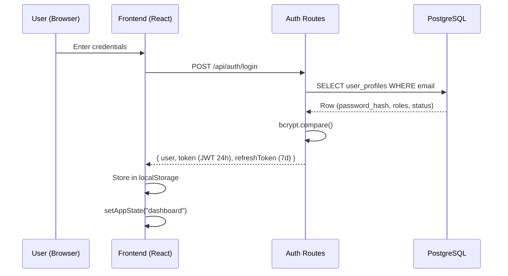
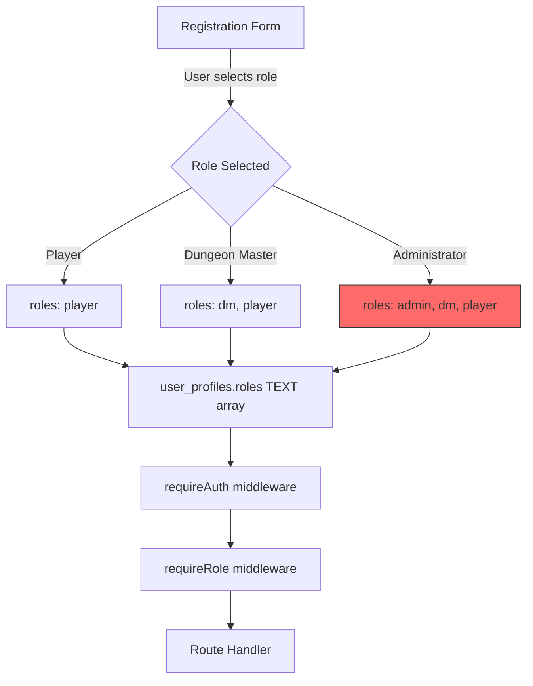
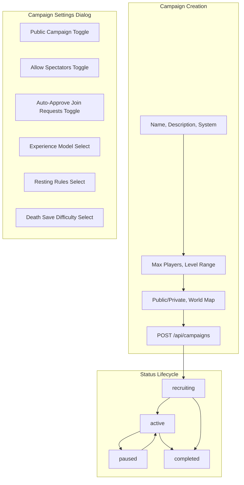
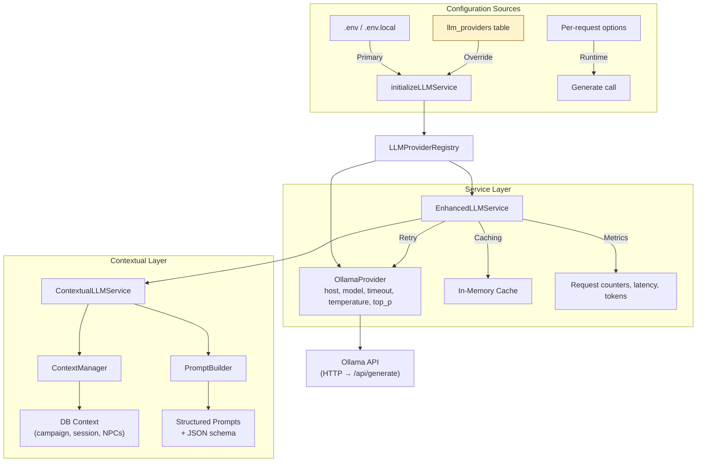
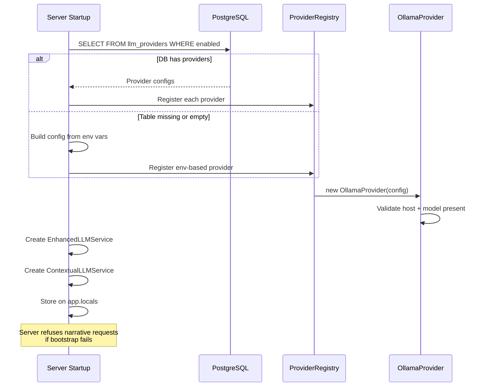
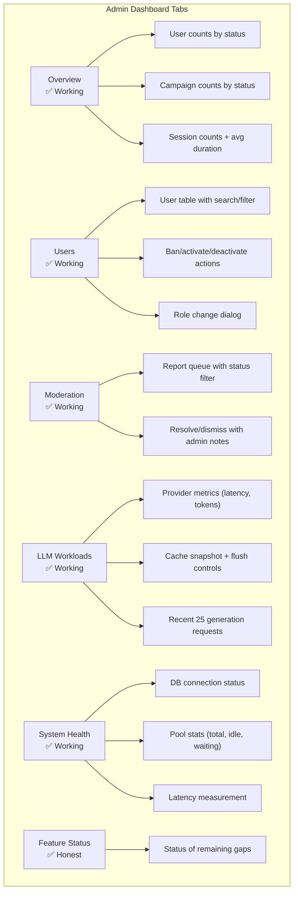
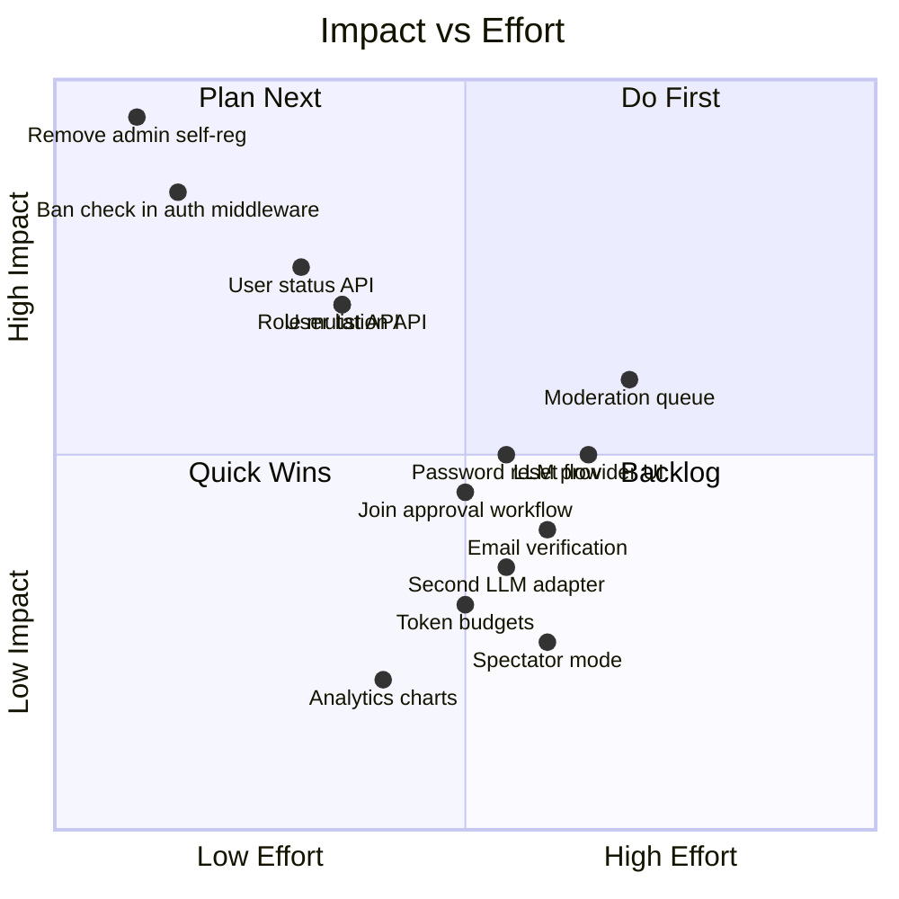
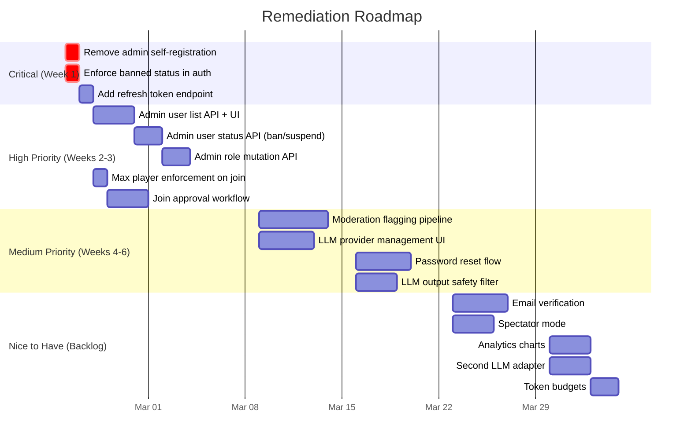

# Questables — Administration, User Management & LLM Configuration Analysis

**Date:** 2026-02-21  
**Scope:** Full audit of user management, moderation, campaign settings, administration tooling, LLM configuration and setup — UI and backend.

---

## Executive Summary

Questables has a solid foundational architecture for authentication, role-based access, campaign settings, and LLM integration. However, several critical gaps exist — most notably around **user moderation**, **admin-level user management actions**, and **role escalation governance**. The LLM subsystem is well-abstracted but currently single-provider (Ollama) with no UI for provider CRUD. The admin dashboard itself acknowledges these gaps honestly in its "Feature Status" tab, which is a good starting point.

This document maps every working component, every gap, and proposes concrete remediation.

---

## 1. Authentication & Session Management

### Current Status: ✅ Functional



| Feature | Status | Notes |
|---------|--------|-------|
| Login (email + password) | ✅ Working | bcrypt hash, JWT 24h, refresh token 7d |
| Registration | ✅ Working | Username + email uniqueness, min 6-char password |
| Session persistence | ✅ Working | `GET /api/users/profile` validates stored token on startup |
| Auto-logout on 401 | ✅ Working | `AUTH_LOGOUT_EVENT` custom event clears localStorage |
| Rate limiting | ✅ Defined | 5 attempts / 15 minutes on auth endpoints |
| Password reset | ❌ Not implemented | "Forgot Password" link exists in UI but is non-functional |
| Email verification | ❌ Not implemented | No verification step on registration |
| Refresh token rotation | ✅ Working | `POST /api/auth/refresh` verifies refresh token, checks ban status, returns new token pair |
| Secure token storage | ⚠️ Concern | JWT stored in `localStorage` (vulnerable to XSS) |

### Issues & Recommendations

1. **Password reset flow** — The UI has a "Forgot Password" link that does nothing. Either wire it up with email-based reset tokens or remove the dead link to avoid user confusion.

2. **Email verification** — Users can register with any email, no verification. This means fake accounts are trivially easy to create and there's no way to do account recovery.

3. **localStorage for JWT** — Storing auth tokens in `localStorage` exposes them to XSS. Consider `httpOnly` cookies with `SameSite=Strict` as the transport mechanism.

4. ~~**Refresh token lifecycle**~~ — ✅ **Remediated.** `POST /api/auth/refresh` endpoint implemented. Validates refresh token JWT, checks user exists and is not banned, returns new access + refresh token pair.

---

## 2. Role System & Access Control

### Current Status: ⚠️ Functional but Governance Gaps



| Feature | Status | Notes |
|---------|--------|-------|
| Role storage | ✅ Working | `TEXT[]` on `user_profiles`, CHECK constraint |
| Role-based middleware | ✅ Working | `requireAuth`, `requireRole(['dm'])`, etc. |
| Campaign ownership middleware | ✅ Working | `requireCampaignOwnership`, `requireCampaignParticipation` |
| Character ownership middleware | ✅ Working | `requireCharacterOwnership` |
| Dashboard view gating | ✅ Working | Admin tab only visible if `user.roles.includes("admin")` |
| Role normalization | ✅ Robust | Triple-normalized: `UserContext.tsx`, `api/users.ts`, `services/users/service.js` |
| Self-registration as Admin | ✅ Fixed | Server hardcodes `roles = ['player']`; admin option removed from registration UI |
| Role mutation API | ✅ Working | `PATCH /api/admin/users/:id/roles` with admin-only access, self-demotion protection |
| Role audit logging | ❌ Missing | No record of when/how roles were assigned |

### ✅ Remediated: Admin Self-Registration Removed

The registration form previously offered three account types including Administrator. The server route accepted the `roles` array directly from the client. **This has been fixed:**

- Server now hardcodes `const roles = ['player']` regardless of client request body
- Registration UI only offers Player and DM options
- `Crown` icon import removed from registration modal
- Admin accounts can only be created via DB seed (`setup-database.js`) or via `PATCH /api/admin/users/:id/roles`

### ✅ Remediated: Role Management API

- `PATCH /api/admin/users/:id/roles` — Admin-only role mutation with self-demotion protection
- UI in admin dashboard "Users" tab with role change dialog

### Remaining Recommendations

1. **Role audit logging** — No record of when/how roles were assigned. Consider a `role_change_audit` table.

2. **Consider separating DM role from self-registration** — Making DM a role that admins grant (or auto-granting on first campaign creation) would prevent abuse of DM-level features.

---

## 3. User Management (Admin)

### Current Status: ✅ Core Management Implemented

| Feature | Status | Notes |
|---------|--------|-------|
| Admin metrics overview | ✅ Working | `/api/admin/metrics` — counts by status, 7-day signups |
| User profile read (self) | ✅ Working | `GET /api/users/profile` |
| User profile update (self) | ✅ Working | `PATCH /api/users/profile` — username, avatar, timezone |
| Default admin seed | ✅ Working | `setup-database.js` creates admin@localhost |
| Admin user list | ✅ Working | `GET /api/admin/users` — paginated, search by username/email, status filter |
| Admin user detail | ✅ Working | `GET /api/admin/users/:id` — full profile + campaign/character counts |
| Ban / suspend user | ✅ Working | `PATCH /api/admin/users/:id/status` — self-ban protection |
| Activate / deactivate user | ✅ Working | Same endpoint, supports active/inactive/banned |
| Role mutation | ✅ Working | `PATCH /api/admin/users/:id/roles` — self-demotion protection |
| Admin Users tab | ✅ Working | Table with search, filter, pagination, dropdown actions, role dialog |
| User deletion | ❌ Missing | No API for admins to delete users |
| Login-as-user (impersonation) | ❌ Missing | No support for admin debugging |
| Activity audit log | ❌ Missing | No structured audit trail (telemetry events logged but not queryable) |

### Implemented API Surface

| Method | Path | Purpose | Access |
|--------|------|---------|--------|
| `GET` | `/api/admin/users` | Paginated user list with search/filter | Admin |
| `GET` | `/api/admin/users/:id` | Full user detail (profiles, characters, campaigns) | Admin |
| `PATCH` | `/api/admin/users/:id/status` | Set status: active/inactive/banned | Admin |
| `PATCH` | `/api/admin/users/:id/roles` | Modify roles array | Admin |

### Remaining Gaps

| Method | Path | Purpose | Access |
|--------|------|---------|--------|
| `DELETE` | `/api/admin/users/:id` | Soft-delete user account | Admin |
| `GET` | `/api/admin/audit-log` | Paginated action audit trail | Admin |

---

## 4. Moderation

### Current Status: ✅ Basic System Implemented

| Feature | Status | Notes |
|---------|--------|-------|
| User reporting | ✅ Working | `POST /api/reports` — any authenticated user, 5 report types |
| Moderation queue (admin) | ✅ Working | `GET /api/admin/moderation/reports` — paginated, status filter |
| Report resolution | ✅ Working | `PATCH /api/admin/moderation/reports/:id` — resolve/dismiss with admin notes |
| Report dialog (UI) | ✅ Working | Reusable `ReportDialog` component with type select + description |
| Admin moderation tab | ✅ Working | Table view with resolve/dismiss actions, status filter, pagination |
| Global ban enforcement | ✅ Working | `requireAuth` checks `status` column, returns 403 for banned/suspended users |
| Login ban check | ✅ Working | Login route rejects banned/suspended users before issuing tokens |
| Chat message moderation | ❌ Missing | No report/flag mechanism for individual messages |
| Chat message deletion (admin) | ⚠️ Partial | DM and sender can delete their own messages; no admin override |
| Content filtering | ❌ Missing | No profanity/abuse filters |
| LLM output moderation | ❌ Missing | Generated narratives are displayed verbatim; no safety filter |
| Campaign reporting | ⚠️ Partial | Reports can include a `campaign_id` reference but no dedicated campaign report flow |
| Player kick from campaign | ⚠️ Partial | DM can manage roster but no explicit "kick + ban from campaign" flow |

### ✅ Remediated: Ban Enforcement in Auth

The `requireAuth` middleware now selects and checks the `status` column. Users with `status = 'banned'` or `status = 'suspended'` receive a 403 response. The login route also checks status after password verification.

### Remaining Recommendations

1. **Chat moderation pipeline** — Allow participants to flag individual messages for DM/admin review.

2. **LLM output safety layer** — Even a lightweight keyword/regex check on generated narratives before serving to players.

3. **Campaign-level bans** — Add `status = 'banned'` option to `campaign_players` and an API for DMs to permanently remove players.

---

## 5. Campaign Settings & Configuration

### Current Status: ✅ Largely Functional



| Feature | Status | Notes |
|---------|--------|-------|
| Campaign CRUD | ✅ Working | Create/read/update/delete with DM ownership |
| Campaign settings dialog | ✅ Working | All 6 settings save via `PUT /api/campaigns/:id` |
| Status transitions | ✅ Working | No enforced progression; active requires world map |
| View-only for non-DM | ✅ Working | Settings visible but disabled for players |
| Join request flow | ✅ Working | `auto_approve_join_requests` controls pending vs active status; DM approval/rejection endpoints implemented |
| Player management | ⚠️ Basic | DM can view roster, but limited moderation |
| Spectator mode | ⚠️ Schema only | `allow_spectators` toggleable but spectator access logic not implemented in game view |
| Campaign name uniqueness | ✅ Working | Unique per DM (constraint `uq_campaign_name_per_dm`) |
| Player slot limits | ⚠️ Partial | `max_players` stored but enforcement on join not visible |

### Issues

1. ~~**Join approval workflow**~~ — ✅ **Remediated.** When `auto_approve_join_requests` is `false`, joins insert with `status = 'pending'` (skipping auto-placement). DM endpoints: `GET .../players/pending`, `PATCH .../players/:userId/approve`, `PATCH .../players/:userId/reject`. Schema updated to include `'pending'` in `campaign_players.status` CHECK constraint.

2. **Spectator implementation** — The toggle saves to DB but the game view doesn't differentiate between spectators and players.

3. ~~**Max player enforcement**~~ — The join endpoint now checks `current_players >= max_players` before admitting (was already present in code but not noted in original audit).

---

## 6. LLM Configuration & Setup

### Current Status: ✅ Well-Architected, ⚠️ Single Provider



| Feature | Status | Notes |
|---------|--------|-------|
| Provider abstraction | ✅ Working | `LLMProviderRegistry` supports multiple providers |
| Ollama provider | ✅ Working | Full implementation with structured output (JSON schema) |
| Environment config | ✅ Working | `LLM_PROVIDER`, `LLM_OLLAMA_HOST`, `LLM_OLLAMA_MODEL`, etc. |
| Database provider config | ✅ Working | `llm_providers` table, loaded at startup |
| Health check | ✅ Working | Model availability verification via `client.list()` |
| Caching layer | ✅ Working | TTL-based in-memory cache, configurable via `LLM_CACHE_TTL_MS` |
| Metrics collection | ✅ Working | Request counts, latency, tokens, cache hit rates |
| Admin LLM dashboard | ✅ Working | Metrics, recent requests, cache snapshot + flush |
| Narrative types | ✅ Working | DM narration, scene, NPC dialogue, action, quest, objectives, shop auto-stock |
| Context-aware prompting | ✅ Working | Campaign/session/NPC data injected into prompts |
| Narrative persistence | ✅ Working | All generations stored in `llm_narratives` |
| Error surfacing | ✅ Working | 502/503 for provider failures; no fallback content |
| Multiple provider support | ⚠️ Schema only | Registry supports it, but only `ollama` adapter is implemented |
| Provider CRUD UI | ❌ Missing | No UI for admins to add/edit/remove providers |
| Provider health UI | ⚠️ Partial | `GET /api/admin/llm/providers` returns health but no dedicated UI panel |
| Model selection UI | ❌ Missing | Model is hardcoded in config; no UI to switch models |
| Per-campaign LLM config | ❌ Missing | All campaigns use the same provider/model |
| Token usage quotas | ❌ Missing | No per-user or per-campaign token budget |
| Cost tracking | ❌ Missing | No cost attribution (relevant if moving to paid APIs) |

### Environment Configuration

The default configuration targets a local network Ollama instance:

```
LLM_PROVIDER=ollama
LLM_OLLAMA_HOST=http://192.168.1.34    # On-prem Ollama
LLM_OLLAMA_MODEL=qwen3:8b
LLM_OLLAMA_TIMEOUT_MS=60000
LLM_OLLAMA_TEMPERATURE=0.7
LLM_OLLAMA_TOP_P=0.9
```

### Startup Flow



### Recommendations

1. **Provider management UI** — Build an admin panel tab for managing `llm_providers` entries: add new providers, update host/model, toggle enabled/default, and view real-time health.

2. **Second adapter** — Implement an OpenAI-compatible adapter (`openai-provider.js`). This would unlock OpenAI, Anthropic (via compatibility), Groq, Together, vLLM, and others behind the same interface.

3. **Token budgets** — Add a `token_budget` column to campaigns or users. The `EnhancedLLMService` already tracks token usage per request; enforcing a ceiling is straightforward.

4. **Model selector in Narrative Console** — Let DMs choose from available models per generation if multiple are registered.

---

## 7. Admin Dashboard

### Current Status: ✅ Metrics + Management



| Feature | Status | Notes |
|---------|--------|-------|
| Platform metrics (users, campaigns, sessions) | ✅ Working | Live from `GET /api/admin/metrics` |
| LLM metrics (requests, latency, tokens, cache) | ✅ Working | Live from `GET /api/admin/llm/metrics` |
| LLM cache management (view, flush all, flush key) | ✅ Working | Destructive controls with live UI |
| Database health (status, pool, latency) | ✅ Working | Live from `GET /api/health` |
| Telemetry snapshot | ✅ Working | `GET /api/admin/telemetry` |
| Feature status transparency | ✅ Working | Honest alerts about what's missing |
| User list / search | ✅ Working | Paginated table with username/email search, status filter |
| User management actions | ✅ Working | Ban/activate/deactivate via dropdown, role change dialog |
| Moderation queue | ✅ Working | Report table with resolve/dismiss, admin notes, status filter |
| LLM provider management | ❌ Missing | No CRUD for providers |
| Analytics / visualisation | ❌ Missing | All metrics are tabular; no charts/graphs |

---

## 8. Input Sanitization & Security Posture

### Current Status: ✅ Good Foundation

| Feature | Status | Notes |
|---------|--------|-------|
| XSS prevention (DOMPurify) | ✅ Working | `sanitizeHTML`, `sanitizeChatMessage`, `sanitizePlainText` |
| Chat message sanitization | ✅ Working | Allowed tags: b, i, em, strong, u, br; 2000 char limit |
| Filename sanitization | ✅ Working | Path separator removal, length limits |
| SQL injection prevention | ✅ Working | Parameterised queries throughout |
| UUID validation middleware | ✅ Working | `express-validator` on route params |
| CORS configuration | ⚠️ Not audited | Not visible in provided code |
| Helmet / security headers | ⚠️ Not audited | Not visible in provided code |
| Rate limiting (general) | ⚠️ Partial | Defined for auth; unclear if applied app-wide |

---

## 9. Consolidated Gap Analysis

### Priority Matrix



### Severity Breakdown

| # | Gap | Severity | Area | Status |
|---|-----|----------|------|--------|
| 1 | Admin self-registration open to all | 🔴 Critical | Security | ✅ **Fixed** — server hardcodes `roles = ['player']`, admin option removed from UI |
| 2 | Banned user status not enforced in auth | 🔴 Critical | Security | ✅ **Fixed** — `requireAuth` + login route check status, return 403 |
| 3 | No user management API (list, status, roles) | 🟠 High | Admin | ✅ **Fixed** — 4 endpoints + admin Users tab with full UI |
| 4 | No moderation system at all | 🟠 High | Moderation | ✅ **Fixed** — report submission, admin moderation queue, resolve/dismiss |
| 5 | No password reset flow | 🟡 Medium | Auth | ❌ Remaining |
| 6 | No email verification on registration | 🟡 Medium | Auth | ❌ Remaining |
| 7 | Refresh token unused (no refresh endpoint) | 🟡 Medium | Auth | ✅ **Fixed** — `POST /api/auth/refresh` with ban check |
| 8 | Join approval workflow not implemented | 🟡 Medium | Campaigns | ✅ **Fixed** — pending status, DM approve/reject endpoints |
| 9 | Max player limit not enforced | 🟡 Medium | Campaigns | ✅ Already working (was present in code) |
| 10 | LLM provider management UI | 🟡 Medium | LLM | ❌ Remaining |
| 11 | LLM output safety / content filtering | 🟡 Medium | LLM/Safety | ❌ Remaining |
| 12 | localStorage JWT storage | 🟡 Medium | Security | ❌ Remaining |
| 13 | Spectator mode not functional | 🔵 Low | Campaigns | ❌ Remaining |
| 14 | Analytics visualisations | 🔵 Low | Admin | ❌ Remaining |
| 15 | Second LLM adapter (OpenAI-compat) | 🔵 Low | LLM | ❌ Remaining |
| 16 | Token usage budgets | 🔵 Low | LLM | ❌ Remaining |

---

## 10. Recommended Implementation Order



---

## Appendix: Relevant Files

| Area | Key Files |
|------|-----------|
| Authentication | `server/auth-middleware.js`, `server/routes/auth.routes.js`, `contexts/UserContext.tsx`, `utils/api/auth.ts` |
| User service | `server/services/users/service.js`, `utils/api/users.ts` |
| Admin user management | `server/services/admin/users.js`, `server/routes/admin.routes.js`, `components/admin-user-management.tsx` |
| Moderation | `server/routes/moderation.routes.js`, `components/admin-moderation.tsx`, `components/report-dialog.tsx` |
| Registration UI | `components/register-modal.tsx` |
| Admin dashboard | `components/admin-dashboard.tsx` |
| Campaign settings | `components/settings.tsx`, `components/campaign-manager/settings-dialog.tsx` |
| Campaign routes | `server/routes/campaigns.routes.js` |
| Chat/moderation | `server/routes/chat.routes.js`, `server/services/chat/service.js` |
| Sanitization | `utils/sanitization.tsx` |
| LLM core | `server/llm/index.js`, `server/llm/provider-registry.js`, `server/llm/enhanced-llm-service.js` |
| Ollama provider | `server/llm/providers/ollama-provider.js` |
| LLM context | `server/llm/contextual-service.js`, `server/llm/context/context-manager.js` |
| Narrative UI | `components/narrative-console.tsx` |
| DB schema | `database/schema.sql` |
| DB setup/seed | `server/setup-database.js` |
