# Questables — Alignment Plan

> Bringing the application in line with the D&D Game Process Flow specification.

---

## Executive Summary

Questables has strong foundations: authentication, character creation, campaign management, maps, NPCs, a combat tracker, a narrative LLM system, and real-time WebSocket infrastructure. However, the **in-game experience** currently operates as a collection of independent tools (map, chat, combat tracker, narrative console) rather than as a **cohesive game loop** driven by the LLM Dungeon Master.

The core gap is the absence of a **game phase state machine** — the system that ties exploration, combat, social interaction, and rest into a unified flow where the LLM DM actively orchestrates the game, processes player actions, triggers encounters, and narrates outcomes.

This plan is structured as **four workstreams** executed in dependency order, with each workstream delivering a playable improvement.

---

## Gap Analysis

### What Exists and Is Solid

| Area | Status | Notes |
|---|---|---|
| Authentication & roles | ✅ Complete | JWT, role-based access, DM/player/admin split |
| Character creation | ✅ Complete | 7-step wizard, SRD data, draft saving |
| Campaign management | ✅ Complete | CRUD, settings, statuses, player slots |
| Map system | ✅ Complete | OpenLayers, layers, regions, spawns, fog-of-war potential |
| NPC management | ✅ Complete | Full CRUD, map placement, sentiment, combat stats |
| Combat tracker | ⚠️ Partial | Initiative, HP, conditions — but not integrated into game flow |
| Narrative system | ⚠️ Partial | LLM generates text on demand — but not wired into the action loop |
| Chat system | ✅ Complete | 4 channel types (party, private, dm_whisper, dm_broadcast), unread tracking, channel-aware WebSocket routing |
| Session management | ✅ Complete | Scheduling, attendance, game state auto-init on activation |
| WebSocket infra | ✅ Complete | Real-time events, reconnection, multiple event types |

### What Is Missing

| Gap | Impact | Process Flow Reference |
|---|---|---|
| ~~**Game phase state machine**~~ | ✅ Implemented (WS1) — 4 phases, server-authoritative JSONB on sessions, validated transitions, real-time sync | §1, §3–6 |
| ~~**Turn order system (exploration)**~~ | ✅ Implemented (WS1) — Round-robin in exploration/social, initiative in combat, DM world turn detection | §3 |
| **Player action declaration** | No UI for declaring turn actions (move, search, interact, use item, cast spell); movement is the only action | §3, §8 |
| **DM action processing loop** | LLM is a passive text generator, not an active adjudicator receiving actions and returning structured outcomes | §8, §14 |
| **Phase transitions** | No triggers to move between phases (encounter on map region entry, NPC dialogue → social, rest initiation) | §13 |
| ~~**Communication channels**~~ | ✅ Implemented (WS2) — 4 channel types (party, private, dm_whisper, dm_broadcast), per-user WebSocket routing, unread tracking | §7 |
| ~~**DM world turn**~~ | ✅ Partially implemented (WS1) — worldTurnPending detection, executeDmWorldTurn API. Automation (NPC patrols, encounters) deferred to WS3. | §3 |
| **Combat action economy** | Tracker handles initiative and HP, but no action/bonus action/movement/reaction structure | §4.2, §4.4 |
| **Combat resolution flow** | No XP distribution, loot phase, or map state updates after combat ends | §4.3 |
| **Rest mechanics** | No short/long rest flow, no hit dice spending, no spell slot recovery, no random encounter interruption | §6 |
| **Death & dying** | No death saves, stabilisation, or instant death logic | §11 |
| **Levelling** | No XP threshold detection, level-up flow, or ASI/feat selection | §10 |
| **Live player state during play** | Character sheet is read-only display; no real-time spell slot, HP, condition, or resource tracking during gameplay | §9 |
| **Encounter triggers from map** | Regions exist but don't trigger encounters or phase changes when players enter them | §3 |
| **Structured LLM response format** | Narrative system returns raw text; no structured output (mechanical outcomes, state changes, required rolls, phase transitions) | §14 |

---

## Implementation Plan

### Dependency Map


---

### WS1 — Game State Engine ✅ COMPLETE

**Goal:** Introduce the phase state machine and turn order so the game window knows what phase it's in and whose turn it is.

**Priority:** 🔴 Critical — everything else depends on this.

**Status:** Implemented. Game state JSONB on sessions table, game_state_log audit table, phase transition rules, turn order management, 6 REST endpoints, 4 WebSocket events, GameStateContext, PhaseIndicator, TurnBanner, DM sidebar controls. Session activation auto-initialises game state.

#### 1.1 Game Phase State Machine

Extend `GameSessionContext` (or create a new `GamePhaseContext`) to track the current phase.

**New state shape:**

```typescript
type GamePhase = "exploration" | "combat" | "social" | "rest";

interface GameState {
  phase: GamePhase;
  previousPhase: GamePhase | null;
  turnOrder: string[];          // player IDs in turn sequence
  activePlayerId: string | null;
  roundNumber: number;
  worldTurnPending: boolean;    // true after all players have acted
}
```

**Where it lives:** Server-authoritative, synced to clients via WebSocket. The server is the single source of truth for phase and turn. Clients receive `game-state-update` events.

**New API endpoints:**

| Method | Endpoint | Description |
|---|---|---|
| GET | `/api/campaigns/{id}/game-state` | Current phase, turn, round |
| PUT | `/api/campaigns/{id}/game-state/phase` | Transition phase (DM or system) |
| POST | `/api/campaigns/{id}/game-state/end-turn` | Active player ends their turn |
| POST | `/api/campaigns/{id}/game-state/dm-world-turn` | Trigger DM world turn processing |

**New WebSocket events:**

| Event | Direction | Payload |
|---|---|---|
| `game-phase-changed` | Server → All | `{ phase, previousPhase, reason }` |
| `turn-advanced` | Server → All | `{ activePlayerId, roundNumber }` |
| `world-turn-started` | Server → All | `{ roundNumber }` |
| `world-turn-completed` | Server → All | `{ narration, stateChanges[] }` |

**Database:** Add `game_state` JSONB column to `campaigns` table (or create a `game_sessions_state` table linked to the active session).

#### 1.2 Turn Order Manager

- On session start or phase entry: server builds turn order from active participants.
- **Exploration:** Round-robin by seating order (join order or DM-set order).
- **Combat:** Initiative order (already exists in encounter system — bridge it).
- Server tracks `activePlayerId`. Only the active player can submit turn actions (enforced server-side).
- Free actions (chat, view inventory) are exempt from turn gating.

#### 1.3 UI: Phase Indicator & Turn Banner

- Add a **phase indicator** to the game window header (next to session badge). Shows current phase with colour coding and icon:
  - 🗺️ Exploration (green) | ⚔️ Combat (red) | 💬 Social (blue) | 🏕️ Rest (amber)
- Add a **turn banner** below the header: "It's [Player Name]'s turn" with a countdown timer (optional, configurable per campaign).
- When it's the player's own turn, the banner highlights and the action panel activates.

#### 1.4 Phase Transition Logic

Server-side rules engine that evaluates triggers:

| Trigger | From → To | Detection |
|---|---|---|
| Player enters hostile region on map | Exploration → Combat | Cross-reference player position against region polygons with `type: "encounter"` |
| DM manually starts encounter | Any → Combat | DM clicks "Start Encounter" in DM sidebar |
| Player initiates NPC dialogue | Exploration → Social | Player action targets an NPC |
| All hostiles defeated/fled | Combat → Exploration | Encounter participant HP check |
| Parley initiated during combat | Combat → Social | Player declares parley action, DM approves |
| Party initiates rest | Exploration → Rest | All players confirm rest (or DM forces it) |
| Rest completes | Rest → Exploration | Timer / DM confirmation |
| NPC turns hostile during social | Social → Combat | DM triggers or LLM determines hostility |
| Social interaction concludes | Social → Exploration | Player exits dialogue or DM ends scene |

---

### WS2 — Communication Channels ✅ COMPLETE

**Goal:** Implement the four communication channels defined in the process flow.

**Priority:** 🔴 Critical — the DM loop in WS3 depends on private DM messaging.

**Status:** Implemented. channel_type + channel_target_user_id columns on chat_messages, chat_read_cursors table, channel-aware message creation/listing/visibility, channel validation middleware, per-user WebSocket routing for private/whisper messages, ChatChannelTabs UI, unread tracking, visual differentiation per channel type.

#### 2.1 Channel Model

Extend the chat system to support channel scoping. Currently all messages go to a single campaign stream.

**New message schema additions:**

```typescript
type ChatChannel = 
  | { type: "party" }                                    // All players + DM
  | { type: "private", targetUserId: string }           // Player ↔ Player
  | { type: "dm_whisper", playerId: string }            // Player ↔ DM only
  | { type: "dm_broadcast" };                           // DM → all (narration)

interface ChatMessage {
  // ... existing fields ...
  channel: ChatChannel;
}
```

**Database:** Add `channel_type` and `channel_target_user_id` columns to the messages table. Default existing messages to `channel_type: "party"`.

**API changes:**
- `POST /api/campaigns/{id}/messages` — add `channel` to request body.
- `GET /api/campaigns/{id}/messages` — add `channel_type` and `target_user_id` query filters.

**WebSocket changes:**
- `chat-message` events include channel info.
- Server-side room filtering: private messages only emitted to the two participants. DM whispers only to the player and DM.

#### 2.2 Chat UI Overhaul

- **Channel tabs** at the top of the chat panel:
  - 🎭 Party (default)
  - 🤫 DM Whisper (messages only visible to you and the DM)
  - 📢 DM Narration (read-only feed of all DM broadcast narration)
- **Player-to-player DMs:** Accessed via a player list or right-click on a player token on the map. Opens a private tab.
- **Unread indicators** on tabs when messages arrive in non-active channels.
- **Visual differentiation:** DM narration messages rendered in a distinct style (e.g., parchment background, italic).

#### 2.3 DM Private Response Behaviour

When a player sends a DM whisper, the server routes it to the LLM for processing (in WS3). The LLM follows the rules from Process Flow §7:

- Rules questions → factual answer, private only
- Secret actions → resolve privately, narrate visible outcome to party
- Meta questions → helpful answer, private only

---

### WS3 — Exploration Phase & DM Action Loop ✅ COMPLETE

**Goal:** Build the core gameplay loop — players declare actions on their turn, the LLM DM processes them and returns structured outcomes.

**Priority:** 🟠 High — this is where the game becomes a game.

**Depends on:** WS1 (phase/turn system), WS2 (DM whisper channel for private resolution).

**Status:** Implemented. session_player_actions + session_live_states tables, structured LLM output via Ollama `format` parameter, non-blocking action processing pipeline, roll resolution flow, movement gating, region triggers, live state management, ActionContext + LiveStateContext, ActionPanel + ActionGrid + RollPrompt + LiveStateBar UI, 6 new WebSocket events, DM world turn LLM toggle.

#### 3.1 Player Action Declaration UI

Replace the current passive game window with an **action panel** that appears during a player's turn. This sits between the map and chat panels (or overlays the bottom of the map).

**Exploration action menu:**

| Action | Turn Cost | UI Element |
|---|---|---|
| Move | ✅ Yes | Click destination on map (existing movement, but now gated to active turn) |
| Interact with Object | ✅ Yes | Click point of interest on map → context menu |
| Search / Investigate | ✅ Yes | Button → optional target selection → DM resolves |
| Use Item | ✅ Yes | Opens inventory picker → select item → select target → DM resolves |
| Cast Spell | ✅ Yes | Opens spellbook picker → select spell → select target → DM resolves |
| Talk to NPC | ✅ Yes (triggers Social) | Click NPC on map or select from nearby NPC list |
| Pass Turn | ✅ Yes | "End Turn" button |
| Open Inventory | ❌ Free | Existing sidebar panel — no changes |
| Open Spellbook | ❌ Free | Existing sidebar panel — no changes |
| Chat (any channel) | ❌ Free | Existing chat — no changes |
| Whisper to DM | ❌ Free | New DM whisper channel |

**Action submission payload:**

```typescript
interface PlayerAction {
  campaignId: string;
  playerId: string;
  actionType: "move" | "interact" | "search" | "use_item" | "cast_spell" 
            | "talk_to_npc" | "custom" | "pass";
  target?: {
    type: "coordinate" | "npc" | "player" | "object" | "self";
    id?: string;
    position?: { x: number; y: number };
  };
  details?: string;       // Free-text for creative actions
  itemId?: string;        // For use_item
  spellId?: string;       // For cast_spell
}
```

**New API endpoint:**

| Method | Endpoint | Description |
|---|---|---|
| POST | `/api/campaigns/{id}/actions` | Submit player action for DM resolution |

Server validates: is it this player's turn? Is the action legal given current phase? Then routes to the LLM DM.

#### 3.2 LLM DM Processing Pipeline

This is the heart of the system. When a player action arrives, the server constructs a prompt for the LLM and parses the structured response.

**Pipeline:**

```mermaid
flowchart TD
    A[Player Action Received] --> B[Build DM Context Payload]
    B --> C[Construct LLM Prompt]
    C --> D[Call Local LLM]
    D --> E[Parse Structured Response]
    E --> F{Rolls Required?}
    F -->|Yes| G[Request Roll from Player / Auto-Roll]
    G --> H[Re-submit with Roll Results]
    H --> D
    F -->|No| I[Apply State Changes]
    I --> J[Broadcast Narration via DM Broadcast Channel]
    J --> K[Broadcast State Updates via WebSocket]
    K --> L{Phase Transition?}
    L -->|Yes| M[Execute Phase Transition — WS1]
    L -->|No| N[Advance Turn — WS1]
```



**DM context payload** (sent to LLM on every action, per Process Flow §14):

```typescript
interface DMContext {
  currentPhase: GamePhase;
  activePlayer: {
    id: string;
    name: string;
    characterName: string;
    class: string;
    level: number;
    hp: { current: number; max: number };
    ac: number;
    conditions: string[];
    relevantInventory: InventoryItem[];  // Equipped + recently used
    preparedSpells: Spell[];
    position: { x: number; y: number };
    abilityScores: AbilityScores;
    proficiencyBonus: number;
  };
  action: PlayerAction;
  sceneContext: {
    locationName: string;
    locationDescription: string;
    visibleNPCs: NPC[];
    visiblePlayers: PlayerSummary[];
    nearbyObjects: MapFeature[];
    regionTags: string[];        // From map regions the player is in
    lightLevel: string;
    timeOfDay: string;
  };
  combatState?: CombatContext;    // Only if in combat
  recentNarration: string[];      // Last 10 narration messages
  npcMemory?: NPCMemory;         // If interacting with an NPC
  campaignNotes: string;          // DM's campaign-level notes / tone guidance
}
```

**Required LLM response format** (enforce via system prompt + JSON schema):

```typescript
interface DMResponse {
  narration: string;                    // Flavour text for party
  privateMessage?: {                    // Only for specific player(s)
    playerId: string;
    text: string;
  };
  mechanicalOutcome?: {
    type: "damage" | "healing" | "condition" | "item_gained" | "item_lost" 
        | "xp_gained" | "gold_changed" | "spell_slot_used" | "position_changed";
    targets: {
      entityId: string;
      entityType: "player" | "npc" | "enemy";
      changes: Record<string, any>;     // e.g. { hp: -8, conditions: ["prone"] }
    }[];
  };
  requiredRolls?: {
    playerId: string;
    rollType: string;                   // "ability_check", "saving_throw", "attack"
    ability?: string;                   // "STR", "DEX", etc.
    skill?: string;                     // "perception", "athletics", etc.
    dc?: number;                        // DM sets the DC
    advantage?: boolean;
    disadvantage?: boolean;
  }[];
  stateChanges?: {
    type: "map_reveal" | "npc_disposition" | "quest_update" | "environment";
    data: Record<string, any>;
  }[];
  phaseTransition?: {
    newPhase: GamePhase;
    reason: string;
    encounterData?: any;               // If transitioning to combat
  };
}
```

#### 3.3 Roll Resolution Flow

When the LLM requests a roll:

1. Server sends a `roll-requested` WebSocket event to the target player.
2. Client shows a **roll prompt** overlay: "The DM asks for a Perception check (DC hidden). Roll d20 + [modifier]."
3. Player clicks "Roll" → system generates the roll (or player types a manual roll expression).
4. Result sent back to server → server re-invokes LLM with the roll result included in context.
5. LLM returns final narration + outcome.

**New WebSocket events:**

| Event | Direction | Payload |
|---|---|---|
| `roll-requested` | Server → Player | `{ rollType, ability, skill, reason }` |
| `roll-submitted` | Player → Server | `{ rollValue, modifier, total, natural }` |
| `roll-result` | Server → All (or private) | `{ playerId, rollType, total, success }` |

#### 3.4 DM World Turn

After all players have acted in a round:

1. Server fires the DM world turn automatically.
2. Sends a context payload to the LLM with:
   - All player positions and recent actions this round.
   - NPC patrol routes and scheduled movements.
   - Environmental timers (torch duration, weather changes).
   - Wandering encounter tables for current region.
3. LLM returns:
   - Narration for any world events.
   - NPC movements (applied to map).
   - Random encounter roll result → possible phase transition to combat.
   - Time advancement.
4. Results broadcast to all players via DM Broadcast channel.

#### 3.5 Encounter Trigger Integration

Wire the existing map **regions** (which already have types like `encounter`, `narrative`, `travel`) into the phase transition system:

- When a player's movement enters a region polygon, server checks region type.
- `encounter` regions: query attached objectives or encounter tables → DM decides if encounter fires (can be probability-based or LLM-determined).
- `narrative` regions: LLM generates arrival narration automatically.
- `travel` regions: apply travel speed modifiers, random encounter checks.

This leverages existing infrastructure (regions, objectives, map cells) and connects it to the new game loop.

#### 3.6 Movement Gating

Currently movement is free-form via `POST /api/campaigns/{id}/players/{playerId}/move`. Changes:

- **Exploration:** Movement is gated to the active player's turn. Server rejects move requests from non-active players.
- **Combat:** Movement limited to character speed (in grid units). Track remaining movement per turn. Difficult terrain from map regions costs double.
- **Free movement toggle:** DM can toggle unrestricted movement for theatre-of-mind play (campaign setting).

---

### WS4 — Combat Overhaul

**Goal:** Transform the combat tracker from a manual bookkeeping tool into a fully integrated combat phase with action economy, DM-controlled enemies, and resolution flow.

**Priority:** 🟡 Medium — playable exploration should land first.

**Depends on:** WS3 (action system and LLM pipeline).

#### 4.1 Combat Initiation

When the system transitions to combat phase:

1. Create encounter automatically (or link to existing prepared encounter).
2. All players + hostile NPCs/enemies roll initiative.
   - Players: system rolls `d20 + DEX modifier` (or use existing initiative endpoint).
   - Enemies: LLM provides initiative or system rolls from stat blocks.
3. Sort combatants into initiative order.
4. Check for surprise (DM/LLM determines based on context — stealth vs perception).
5. Broadcast `game-phase-changed` with `phase: "combat"` and initiative order.

#### 4.2 Combat Action Economy

Extend the action panel for combat with the full action economy:

**Per-turn budget displayed in UI:**

```
┌──────────────────────────────────────────────────┐
│  ⚔️ ACTION: [Available]    🏃 MOVEMENT: 30/30ft  │
│  ⚡ BONUS ACTION: [Available]  🛡️ REACTION: [Ready] │
└──────────────────────────────────────────────────┘
```

**Action options (combat):**

| Action | Type | Resolution |
|---|---|---|
| Attack | Action | Roll to hit → LLM narrates → apply damage |
| Cast Spell | Action (or Bonus) | Select spell + target → validate spell slot → LLM resolves |
| Dash | Action | Double remaining movement |
| Dodge | Action | Apply dodge condition until next turn |
| Disengage | Action | No opportunity attacks this turn |
| Help | Action | Grant advantage to target ally's next roll |
| Hide | Action | Roll Stealth → LLM sets DC → result |
| Ready | Action | Declare trigger + action → stored for reaction |
| Use Item | Action | Select item → LLM resolves |
| Other / Creative | Action | Free-text → LLM adjudicates |

Each selection is submitted via the same `POST /api/campaigns/{id}/actions` endpoint with `actionType` specific to combat.

Server tracks remaining action budget per turn:

```typescript
interface CombatTurnBudget {
  actionUsed: boolean;
  bonusActionUsed: boolean;
  movementRemaining: number;   // in feet
  reactionUsed: boolean;
  freeInteractionUsed: boolean;
}
```

#### 4.3 Enemy Turns (LLM-Controlled)

When it's an enemy's turn in initiative order:

1. Server sends full combat context to LLM including: enemy stat block, all combatant positions/HP/conditions, tactical situation.
2. LLM returns the enemy's chosen action as a structured `DMResponse`.
3. Server resolves rolls, applies damage/conditions, broadcasts narration.
4. No player input required — enemy turns resolve automatically with a brief narration delay for readability.

#### 4.4 Opportunity Attacks & Reactions

- When a combatant moves out of an enemy's reach, server checks if any combatant has an unused reaction.
- If a player has a reaction: prompt appears — "Goblin is fleeing your reach. Use your reaction for an opportunity attack? [Yes] [No]"
- If an enemy has a reaction: LLM decides.
- Reactions for spells (Shield, Counterspell): player is prompted when the trigger occurs.

**New WebSocket event:**

| Event | Direction | Payload |
|---|---|---|
| `reaction-prompt` | Server → Player | `{ trigger, options[], timeoutSeconds }` |
| `reaction-response` | Player → Server | `{ reactionChoice }` |

#### 4.5 Combat Resolution

When combat ends (per Process Flow §4.3):

1. DM (LLM or manual) declares combat over.
2. Server determines end condition: victory, enemies fled, party fled, parley, TPK.
3. **XP distribution:** Calculate XP from defeated enemies (from CR in stat blocks) → divide among participants → broadcast.
4. **Loot phase:** LLM generates loot description from encounter/objective data → players can pick up items (added to inventory).
5. **Map cleanup:** Remove defeated enemy tokens, update region state.
6. Phase transition back to exploration (or social if parley).

#### 4.6 Concentration Tracking

- When a player casts a concentration spell, track it in their combat state.
- When the player takes damage, server auto-prompts a Constitution saving throw (DC = max of 10 or half damage taken).
- On failure: concentration broken, spell effect removed, all affected entities updated.

---

### WS5 — Social & Rest Phases

**Goal:** Implement the Social and Rest phases to complete the four-phase game loop.

**Priority:** 🟡 Medium — can run in parallel with WS4.

**Depends on:** WS3 (action system, LLM pipeline).

#### 5.1 Social Phase

When a player initiates dialogue with an NPC (from exploration or mid-combat parley):

1. Phase transitions to `social` (or a sub-state within exploration for lightweight NPC chats).
2. **NPC dialogue UI:** A dedicated dialogue panel replaces the action panel, showing:
   - NPC name, portrait (if avatar exists), disposition indicator.
   - Conversation history (this interaction).
   - Free-text input for player dialogue.
   - Quick-action buttons: [Persuade] [Deceive] [Intimidate] [Insight] [Trade] [Leave].
3. Player types dialogue → sent to LLM with NPC state (personality, motivations, secrets, disposition, trust level from existing sentiment system).
4. LLM responds in character as the NPC.
5. Ability checks (persuasion, deception, intimidation, insight) triggered by player quick-actions or detected by LLM from dialogue intent.
6. **Trade:** If NPC is a merchant, trade UI opens (inventory exchange with gold tracking). LLM can influence prices based on disposition.
7. **Quest interaction:** LLM can offer/update/complete quests via structured response. Quest state updated via existing objectives system.
8. **Multi-player social:** Other players can join the conversation (their messages appear in the dialogue). DM mediates turn flow loosely (no strict turn order in social — more natural).
9. Exiting social → return to exploration.

**Integration with existing NPC system:**
- Use existing NPC sentiment/trust tracking from `npc-sentiment-adjusted` WebSocket events.
- LLM receives NPC personality traits, motivations, secrets from the NPC record.
- After each social interaction, LLM outputs a `trust_delta` that updates NPC disposition (already partially supported).

#### 5.2 Rest Phase

When the party initiates rest:

1. DM (or majority vote + DM approval) triggers rest. System checks if location is safe enough (DM judgment or region tag).
2. **Rest type selection:** Short rest (1 hour) or long rest (8 hours).
3. Phase transitions to `rest`.

**Short rest flow:**
- UI shows each player's remaining hit dice and current HP.
- Players choose how many hit dice to spend (click "+/−" per die).
- System rolls hit dice, adds CON modifier, heals HP.
- Restore short-rest class abilities (server checks class features — e.g., Fighter's Second Wind, Warlock spell slots).
- DM narration for time passing.
- Return to exploration.

**Long rest flow:**
- DM (LLM) rolls for random encounter interruption (based on region danger level).
- If encounter triggered → phase transition to combat, rest may resume after.
- If uninterrupted:
  - Full HP restored.
  - All spell slots restored.
  - Long-rest class abilities restored.
  - Hit dice regained (up to half max, rounded down).
  - Temporary conditions cleared (as applicable by D&D rules).
- DM narration for time passing + any world events overnight.
- Return to exploration.

**New API endpoints:**

| Method | Endpoint | Description |
|---|---|---|
| POST | `/api/campaigns/{id}/rest/start` | Initiate rest (type: short/long) |
| POST | `/api/campaigns/{id}/rest/spend-hit-die` | Player spends a hit die |
| POST | `/api/campaigns/{id}/rest/complete` | Finalise rest, apply recovery |

**Player state changes:** These operations modify the live player state (HP, spell slots, hit dice, conditions). This ties into the live player state system from WS3.

---

### WS6 — Death, Levelling & Lifecycle

**Goal:** Implement death saves, character death, and levelling to close the gameplay lifecycle loop.

**Priority:** 🟢 Lower — enhances long-term play.

**Depends on:** WS4 (combat must be functional).

#### 6.1 Death Saves

When a player's HP drops to 0:

1. Check for instant death (damage overflow ≥ max HP). If yes → character dies.
2. Otherwise, player falls unconscious. Add `unconscious` condition.
3. On that player's subsequent turns in combat:
   - UI shows **death save panel** instead of normal action options.
   - "Roll Death Save" button → d20 roll.
   - Results tracked: successes (0–3) and failures (0–3).
   - Natural 20: regain 1 HP, remove unconscious, rejoin combat.
   - Natural 1: counts as 2 failures.
   - 3 successes: stabilised (unconscious but not dying).
   - 3 failures: character dies.
4. **Taking damage at 0 HP:** Auto-fails 1 death save (2 on crit).
5. **Receiving healing at 0 HP:** Regain consciousness, death saves reset.

**State:**

```typescript
interface DeathSaveState {
  active: boolean;
  successes: number;  // 0–3
  failures: number;   // 0–3
  stabilised: boolean;
}
```

**LLM behaviour:** When narrating death saves, the DM should build tension. On stabilisation or death, deliver significant narration.

#### 6.2 Character Death

On character death:

1. LLM narrates death scene.
2. Player's token changes state on the map (grey/fallen icon).
3. **Resurrection check:** If party has access to resurrection magic and required components, prompt for it. LLM adjudicates.
4. If no resurrection:
   - Player enters **spectator mode** for remainder of combat/session.
   - Option to create a new character (via existing character wizard) to be introduced at an appropriate narrative moment.
   - DM (LLM) determines when/how the new character enters the story.

#### 6.3 Levelling Up

**XP tracking:**
- XP accumulated from combat encounters (WS4) and quest completion.
- Stored on the character record (existing `xp` field).
- Server checks XP thresholds after every XP award.

**Milestone alternative:**
- DM manually awards levels (existing campaign setting: `experience_model: "milestone"`).
- DM clicks "Level Up" on a player's character from the DM sidebar.

**Level-up flow:**
1. `level-up-available` WebSocket event sent to the player.
2. Player opens a **level-up panel** (new sidebar panel or modal):
   - Shows new HP (roll or average).
   - New class features unlocked.
   - ASI / Feat selection (at appropriate levels: 4, 8, 12, 16, 19).
   - New spell slots and spell learning/preparation (for casters).
3. Player confirms choices → `PUT /api/characters/{id}` with updated stats.
4. DM (LLM) narrates growth flavour text.

**Level-up can happen between sessions or during rest.** It should not interrupt combat flow.

---

## Live Player State System (Cross-Cutting)

This underpins WS3–WS6. The character sheet must become a **live, mutable game object** rather than a static display.

**Current state:** Character data is loaded once from `GET /api/characters/{id}` and rendered read-only.

**Required changes:**

1. **Server-side live state:** During an active session, maintain a working copy of each character's mutable fields:
   - `hp.current`, `hp.temporary`
   - `spell_slots[level].current`
   - `hit_dice.current`
   - `conditions[]`
   - `class_resources` (ki points, rage uses, sorcery points, etc.)
   - `inventory` (items gained/lost during play)
   - `gold`
   - `xp`
   - `position`
   - `death_saves`

2. **Mutation API:**

   | Method | Endpoint | Description |
   |---|---|---|
   | PATCH | `/api/characters/{id}/live-state` | Update any mutable field during play |
   | GET | `/api/characters/{id}/live-state` | Get current live state |
   | POST | `/api/characters/{id}/live-state/sync` | Persist live state back to character record |

3. **Real-time sync:** Every state mutation broadcasts a `character-update` event (already exists) with the changed fields. All clients reflect changes immediately.

4. **UI updates:**
   - Character sheet panel shows **live values** with change animations (HP bar fills/drains, spell slot dots toggle).
   - Inventory panel reflects items gained/lost in real time.
   - Conditions display on player tokens on the map.
   - Spell slot tracker in the spellbook panel.

5. **Session persistence:** On session end, live state is synced back to the permanent character record. On session start, live state is initialised from the character record.

---

## Implementation Sequence

```mermaid
gantt
    title Questables Alignment Roadmap
    dateFormat  YYYY-MM-DD
    axisFormat  %b

    section WS1 — Game State Engine
    Phase state machine + DB          :w1a, 2025-01-01, 5d
    Turn order manager                :w1b, after w1a, 4d
    Phase indicator + turn banner UI  :w1c, after w1a, 3d
    Phase transition rules engine     :w1d, after w1b, 5d

    section WS2 — Communication
    Channel model + DB migration      :w2a, 2025-01-01, 3d
    Chat UI tabs + private DMs        :w2b, after w2a, 5d
    DM whisper routing                :w2c, after w2b, 3d

    section WS3 — Exploration & DM Loop
    Action declaration UI             :w3a, after w1d, 5d
    LLM DM processing pipeline        :w3b, after w3a, 8d
    Roll resolution flow              :w3c, after w3b, 4d
    DM world turn                     :w3d, after w3c, 4d
    Encounter trigger integration     :w3e, after w3d, 3d
    Movement gating                   :w3f, after w1d, 3d
    Live player state system          :w3g, after w3a, 6d

    section WS4 — Combat Overhaul
    Combat initiation bridge          :w4a, after w3b, 4d
    Action economy UI + server        :w4b, after w4a, 6d
    LLM enemy turn control            :w4c, after w4b, 5d
    Reactions + opportunity attacks    :w4d, after w4c, 4d
    Combat resolution + loot          :w4e, after w4d, 4d
    Concentration tracking            :w4f, after w4b, 2d

    section WS5 — Social & Rest
    Social phase NPC dialogue UI      :w5a, after w3b, 5d
    Trade integration                 :w5b, after w5a, 3d
    Short rest flow                   :w5c, after w3g, 4d
    Long rest + random encounters     :w5d, after w5c, 3d

    section WS6 — Death & Levelling
    Death saves system                :w6a, after w4b, 4d
    Character death + spectator mode  :w6b, after w6a, 3d
    Level-up flow                     :w6c, after w6a, 5d
```



---

## Summary of New Infrastructure

| Component | Type | Description |
|---|---|---|
| `GamePhaseContext` | React Context | Client-side phase/turn state |
| Phase transition rules engine | Server service | Evaluates triggers, enforces valid transitions |
| Action processing pipeline | Server service | Receives player actions, builds LLM context, parses responses |
| LLM DM prompt builder | Server service | Constructs structured prompts from game state |
| LLM response parser | Server service | Validates and extracts structured `DMResponse` objects |
| Live character state manager | Server service | Tracks mutable character fields during sessions |
| Channel routing | Server (WebSocket) | Routes messages to correct recipients based on channel type |
| Roll resolution handler | Server + Client | Manages async roll request/response flow |
| Combat action budget tracker | Server service | Enforces action economy per combat turn |
| Rest processor | Server service | Handles hit dice, slot recovery, random encounter rolls |
| Death save tracker | Server service | Manages death save state per character |
| Level-up processor | Server service | Detects thresholds, manages ASI/feat/spell choices |

---

## Key Principle

The existing systems — NPCs, regions, encounters, objectives, narrative generation, combat tracker — are all **good building blocks**. The alignment work is not about replacing them but about **connecting them through the game phase state machine and the LLM DM processing loop**, so they activate at the right moments during gameplay rather than being standalone tools the DM operates manually.
