# SRD Compendium — Shop / Lookup / Dictionary System

> **Status:** Planning  
> **Author:** Claude (Architect)  
> **Date:** 2026-02-21  
> **Scope:** Items Compendium, Spells Compendium, NPC Shop system, Loot-table support for LLM

---

## 1. Executive Summary

The project already has solid SRD data infrastructure — `srd_items` and `srd_spells` tables populated from Open5e, REST endpoints for querying them, TypeScript types (`SrdItem`, `SrdSpell`), and a character-creation equipment shop. However, **outside of character creation** there is no way to browse, search, or reference this data. The Spellbook panel explicitly shows an alert: *"Spell metadata is not provided by the backend yet."*

This plan introduces an **SRD Compendium** system that serves three audiences:

| Audience | Need |
|----------|------|
| **Players** | Browse items/spells, purchase from NPC shops, look up spell details from their spellbook |
| **DMs** | Curate NPC shop inventories, build loot tables, drag items into player inventories |
| **LLM** | Query structured item/spell data for encounter loot generation, NPC shop stocking |

---

## 2. Current-State Analysis

### 2.1 What Already Exists

```
✅ PostgreSQL tables: srd_items, srd_spells, srd_spell_classes
✅ Open5e v2 import script (server/scripts/import-srd-data.js)
✅ REST endpoints: GET /api/srd/items?category=X, GET /api/srd/spells?class=X&level=N
✅ Full TypeScript types: SrdItem, SrdSpell (utils/srd/types.ts)
✅ Frontend API client: fetchItems(), fetchSpells() (utils/api/srd.ts)
✅ Equipment shop in character wizard (components/character-wizard/steps/equipment-shop.tsx)
✅ Spellbook panel (components/spellbook.tsx) — but NO spell detail resolution
✅ Icon sidebar + expandable panel architecture for game-view tooling
```

### 2.2 Key Gaps

```
❌ No standalone item browser/lookup outside character creation
❌ No spell detail resolution — spellbook only stores string IDs, never fetches metadata
❌ No NPC shop entity in the database
❌ No loot-table / treasure-hoard data structure
❌ No DM-facing shop editor or loot generator
❌ No LLM-accessible endpoint for structured item/spell queries
❌ No "Compendium" panel in the game-view icon sidebar
```

### 2.3 Existing Data Shape (for reference)

**SrdItem** — `srd_items` table:
```typescript
{
  key: string;          // "longsword", "chain-mail"
  name: string;         // "Longsword", "Chain Mail"
  desc_text: string;    // Full markdown description
  category_key: string; // "weapon", "armor", "adventuring-gear", "tools", etc.
  rarity_key: string;   // "common", "uncommon", etc.
  cost: string;         // GP value as string (e.g. "15", "0.1")
  weight: number;       // Pounds
  requires_attunement: boolean;
  document_source: string;
}
```

**SrdSpell** — `srd_spells` table:
```typescript
{
  key: string;                // "fireball", "cure-wounds"
  name: string;               // "Fireball", "Cure Wounds"
  desc_text: string;          // Full description (markdown)
  level: number;              // 0 = cantrip, 1-9
  school_key: string;         // "evocation", "abjuration"
  casting_time: string;       // "1 action", "1 bonus action"
  range_text: string;         // "150 feet", "Self"
  duration: string;           // "Instantaneous", "Concentration, up to 1 minute"
  concentration: boolean;
  ritual: boolean;
  verbal: boolean; somatic: boolean; material: boolean;
  material_specified: string; // "A tiny ball of bat guano and sulfur"
  damage_roll: string;        // "8d6"
  damage_types: string[];     // ["fire"]
  saving_throw_ability: string;
  attack_roll: boolean;
  class_keys: string[];       // ["wizard", "sorcerer"]
}
```

---

## 3. Architecture Overview

```mermaid
graph TB
    subgraph Database
        SRD_ITEMS[srd_items]
        SRD_SPELLS[srd_spells]
        NPC_SHOPS[npc_shops — NEW]
        SHOP_INV[npc_shop_inventory — NEW]
        LOOT_TABLES[loot_tables — NEW]
        LOOT_ENTRIES[loot_table_entries — NEW]
    end

    subgraph "Server (Express)"
        SRD_ROUTES["/api/srd/* (existing)"]
        SHOP_ROUTES["/api/campaigns/:id/shops — NEW"]
        LOOT_ROUTES["/api/campaigns/:id/loot-tables — NEW"]
        COMPENDIUM_ROUTE["/api/srd/compendium — NEW"]
    end

    subgraph "Frontend Components"
        ICON_SB[IconSidebar + new 'compendium' panel]
        COMP_PANEL[CompendiumPanel — NEW]
        ITEM_BROWSER[ItemBrowser — NEW]
        SPELL_BROWSER[SpellBrowser — NEW]
        DETAIL_MODAL[SrdDetailModal (exists, extend)]
        SHOP_VIEW[ShopView — NEW]
        SPELLBOOK[Spellbook (patch to resolve details)]
    end

    subgraph "LLM Integration"
        LLM_TOOL[LLM Tool: query_compendium]
        LOOT_GEN[Loot Generation Prompt]
    end

    SRD_ITEMS --> SRD_ROUTES
    SRD_SPELLS --> SRD_ROUTES
    NPC_SHOPS --> SHOP_ROUTES
    SHOP_INV --> SHOP_ROUTES
    LOOT_TABLES --> LOOT_ROUTES
    LOOT_ENTRIES --> LOOT_ROUTES

    SRD_ROUTES --> COMP_PANEL
    SRD_ROUTES --> ITEM_BROWSER
    SRD_ROUTES --> SPELL_BROWSER
    SHOP_ROUTES --> SHOP_VIEW
    COMPENDIUM_ROUTE --> LLM_TOOL

    ICON_SB --> COMP_PANEL
    COMP_PANEL --> ITEM_BROWSER
    COMP_PANEL --> SPELL_BROWSER
    COMP_PANEL --> SHOP_VIEW
    ITEM_BROWSER --> DETAIL_MODAL
    SPELL_BROWSER --> DETAIL_MODAL
```

---

## 4. Data Model — New Tables

### 4.1 `npc_shops`

Represents a shop that a DM creates and attaches to a campaign. Can optionally be linked to an NPC entity.

```sql
CREATE TABLE npc_shops (
  id            UUID PRIMARY KEY DEFAULT gen_random_uuid(),
  campaign_id   UUID NOT NULL REFERENCES campaigns(id) ON DELETE CASCADE,
  name          TEXT NOT NULL,                          -- "Grimtooth's Armory"
  description   TEXT,                                    -- Flavor text
  npc_id        UUID REFERENCES npcs(id) ON DELETE SET NULL,
  shop_type     TEXT NOT NULL DEFAULT 'general',        -- general | weapons | armor | magic | potions | scrolls
  price_modifier NUMERIC(4,2) NOT NULL DEFAULT 1.00,   -- 1.0 = standard, 1.5 = 50% markup
  is_active     BOOLEAN NOT NULL DEFAULT true,          -- Players can see/buy from active shops
  location_text TEXT,                                    -- "The Rusty Anchor, Dockside Quarter"
  created_at    TIMESTAMPTZ NOT NULL DEFAULT now(),
  updated_at    TIMESTAMPTZ NOT NULL DEFAULT now()
);

CREATE INDEX idx_npc_shops_campaign ON npc_shops(campaign_id);
```

### 4.2 `npc_shop_inventory`

Links SRD items (or custom items) to a shop with stock/pricing overrides.

```sql
CREATE TABLE npc_shop_inventory (
  id             UUID PRIMARY KEY DEFAULT gen_random_uuid(),
  shop_id        UUID NOT NULL REFERENCES npc_shops(id) ON DELETE CASCADE,
  item_key       TEXT NOT NULL,                         -- References srd_items.key
  document_source TEXT NOT NULL DEFAULT 'srd-2024',
  stock_quantity INT,                                    -- NULL = unlimited
  price_override NUMERIC(10,2),                         -- NULL = use SRD cost × shop modifier
  is_available   BOOLEAN NOT NULL DEFAULT true,
  notes          TEXT,                                   -- DM notes ("only sells to guild members")
  created_at     TIMESTAMPTZ NOT NULL DEFAULT now(),

  UNIQUE(shop_id, item_key, document_source)
);

CREATE INDEX idx_shop_inv_shop ON npc_shop_inventory(shop_id);
```

### 4.3 `loot_tables`

DM-defined or system-default loot tables for encounter rewards.

```sql
CREATE TABLE loot_tables (
  id           UUID PRIMARY KEY DEFAULT gen_random_uuid(),
  campaign_id  UUID REFERENCES campaigns(id) ON DELETE CASCADE,  -- NULL = system default
  name         TEXT NOT NULL,                           -- "CR 1-4 Hoard", "Goblin Pockets"
  description  TEXT,
  table_type   TEXT NOT NULL DEFAULT 'custom',          -- custom | individual | hoard
  cr_min       INT,                                     -- Suggested CR range
  cr_max       INT,
  created_at   TIMESTAMPTZ NOT NULL DEFAULT now(),
  updated_at   TIMESTAMPTZ NOT NULL DEFAULT now()
);
```

### 4.4 `loot_table_entries`

Individual entries in a loot table with probability weights.

```sql
CREATE TABLE loot_table_entries (
  id             UUID PRIMARY KEY DEFAULT gen_random_uuid(),
  loot_table_id  UUID NOT NULL REFERENCES loot_tables(id) ON DELETE CASCADE,
  item_key       TEXT,                                  -- NULL if currency-only
  document_source TEXT DEFAULT 'srd-2024',
  weight         INT NOT NULL DEFAULT 1,                -- Probability weight
  quantity_min   INT NOT NULL DEFAULT 1,
  quantity_max   INT NOT NULL DEFAULT 1,
  currency_amount TEXT,                                 -- "2d6 gp", "4d10 sp" (dice expression)
  created_at     TIMESTAMPTZ NOT NULL DEFAULT now()
);

CREATE INDEX idx_loot_entries_table ON loot_table_entries(loot_table_id);
```

---

## 5. API Design — New Endpoints

### 5.1 Enhanced SRD Endpoints

| Method | Endpoint | Description | Used By |
|--------|----------|-------------|---------|
| `GET` | `/api/srd/items?q=sword&category=weapon` | **Full-text search** (NEW param `q`) | Compendium browser |
| `GET` | `/api/srd/items/:key` | Single item detail (already exists) | Detail modal, LLM |
| `GET` | `/api/srd/spells?q=fire&school=evocation` | **Full-text search** (NEW param `q`) | Compendium browser |
| `GET` | `/api/srd/spells/:key` | Single spell detail (already exists) | Spellbook resolve, LLM |
| `GET` | `/api/srd/compendium/search` | **Unified search** across items + spells | LLM tool |

#### Unified Compendium Search (for LLM)

```
GET /api/srd/compendium/search?q=fire&type=spell&cr_appropriate=3&limit=10
```

Returns a simplified JSON payload designed for LLM context windows:

```json
{
  "results": [
    {
      "type": "spell",
      "key": "fireball",
      "name": "Fireball",
      "summary": "Level 3 evocation. 8d6 fire damage, 20ft radius, DEX save.",
      "cost_gp": null,
      "level": 3
    },
    {
      "type": "item",
      "key": "flame-tongue-greatsword",
      "name": "Flame Tongue Greatsword",
      "summary": "Rare weapon. 2d6 extra fire damage while aflame.",
      "cost_gp": null,
      "level": null
    }
  ]
}
```

### 5.2 NPC Shop Endpoints

| Method | Endpoint | Description | Auth |
|--------|----------|-------------|------|
| `POST` | `/api/campaigns/:id/shops` | Create shop | DM |
| `GET` | `/api/campaigns/:id/shops` | List campaign shops | DM + Players (active only) |
| `GET` | `/api/campaigns/:id/shops/:shopId` | Shop detail + inventory | DM + Players |
| `PUT` | `/api/campaigns/:id/shops/:shopId` | Update shop metadata | DM |
| `DELETE` | `/api/campaigns/:id/shops/:shopId` | Delete shop | DM |
| `POST` | `/api/campaigns/:id/shops/:shopId/inventory` | Add item to shop | DM |
| `PUT` | `/api/campaigns/:id/shops/:shopId/inventory/:entryId` | Update stock/price | DM |
| `DELETE` | `/api/campaigns/:id/shops/:shopId/inventory/:entryId` | Remove item | DM |
| `POST` | `/api/campaigns/:id/shops/:shopId/purchase` | Player purchases item | Player |

#### Purchase Flow

```
POST /api/campaigns/:cid/shops/:sid/purchase
Body: { characterId, itemKey, quantity }
→ Validates stock, computes price (SRD cost × modifier × quantity)
→ Deducts gold from character inventory
→ Adds InventoryItem to character
→ Decrements stock (if finite)
→ Emits Socket.io event: "shop:purchase"
```

### 5.3 Loot Table Endpoints

| Method | Endpoint | Description | Auth |
|--------|----------|-------------|------|
| `POST` | `/api/campaigns/:id/loot-tables` | Create loot table | DM |
| `GET` | `/api/campaigns/:id/loot-tables` | List tables | DM |
| `POST` | `/api/campaigns/:id/loot-tables/:tableId/roll` | Roll on table | DM / LLM |
| `DELETE` | `/api/campaigns/:id/loot-tables/:tableId` | Delete table | DM |

---

## 6. Frontend Components

### 6.1 Component Tree

```
components/
├── compendium/
│   ├── compendium-panel.tsx         # Main tabbed container
│   ├── item-browser.tsx             # Searchable/filterable item list
│   ├── spell-browser.tsx            # Searchable/filterable spell list
│   ├── item-detail-card.tsx         # Rich item detail view
│   ├── spell-detail-card.tsx        # Rich spell detail view
│   ├── shop-view.tsx                # Player-facing shop browser
│   ├── shop-editor.tsx              # DM shop inventory editor
│   └── loot-table-editor.tsx        # DM loot table builder
```

### 6.2 Compendium Panel (Main Container)

Rendered inside the `ExpandablePanel` when `activePanel === "compendium"`. Has 3 sub-tabs:

```
┌─────────────────────────────────────┐
│ 📖 Compendium                    ✕  │
├─────────────────────────────────────┤
│ [Items] [Spells] [Shops]            │
├─────────────────────────────────────┤
│                                     │
│  🔍 Search...          Category ▾   │
│                                     │
│  ┌─────────────────────────────┐    │
│  │ Longsword          15 GP    │    │
│  │ Weapon · 3 lb · Versatile   │    │
│  ├─────────────────────────────┤    │
│  │ Chain Mail          75 GP   │    │
│  │ Armor · 55 lb · AC 16      │    │
│  ├─────────────────────────────┤    │
│  │ Healing Potion      50 GP   │    │
│  │ Consumable · 0.5 lb        │    │
│  └─────────────────────────────┘    │
│                                     │
│  Showing 1-20 of 247    [Next →]    │
└─────────────────────────────────────┘
```

### 6.3 Item Browser

**Filters:**
- Free-text search (name, description)
- Category dropdown: All | Weapons | Armor | Adventuring Gear | Tools | Ammunition | Packs | Focuses
- Rarity filter: Common | Uncommon | Rare | Very Rare | Legendary
- Cost range slider (0–5000 GP)
- Source toggle: SRD 2024 | SRD 2014

**Actions per item:**
- Click → expand inline detail card
- "ℹ️ Details" → open full `SrdDetailModal`
- "➕ Add to Cart" (visible in shop context)
- "📋 Copy to Inventory" (DM only, when targeting a player character)

### 6.4 Spell Browser

**Filters:**
- Free-text search (name, description)
- Level: Cantrip | 1st–9th
- School: Abjuration | Conjuration | Divination | Enchantment | Evocation | Illusion | Necromancy | Transmutation
- Class: All | Bard | Cleric | Druid | Paladin | Ranger | Sorcerer | Warlock | Wizard
- Concentration toggle
- Ritual toggle

**Actions per spell:**
- Click → expand inline detail card showing full stats + description
- "ℹ️ Details" → open full modal
- "📝 Learn Spell" → add to character's `spellsKnown` (if character panel active)

### 6.5 Shop View (Player-Facing)

Shown under the "Shops" tab. Lists active shops in the current campaign.

```
┌─────────────────────────────────────┐
│ [Items] [Spells] [Shops]            │
├─────────────────────────────────────┤
│                                     │
│ 🏪 Grimtooth's Armory              │
│ "Fine weapons at fair prices"       │
│ Location: Dockside Quarter          │
│ Price modifier: ×1.2                │
│ [Browse Shop →]                     │
│                                     │
│ 🏪 The Mystic Emporium             │
│ "Potions, scrolls, and wonders"     │
│ Location: Temple District           │
│ [Browse Shop →]                     │
│                                     │
└─────────────────────────────────────┘
```

Clicking "Browse Shop" opens an item list scoped to that shop's inventory with buy buttons and gold tracking.

---

## 7. Wiring Into the UI

### 7.1 Icon Sidebar Addition

Add a new tool entry to `components/icon-sidebar.tsx`:

```typescript
// In the tools array, after "spells":
{
  id: "compendium",
  icon: <Library className="w-5 h-5" />,  // from lucide-react
  label: "Compendium",
},
```

### 7.2 Expandable Panel Routing

Add the case to `components/expandable-panel.tsx`:

```typescript
case "compendium":
  return <CompendiumPanel campaignId={activeCampaignId} />;
```

And in the title/icon helpers:

```typescript
case "compendium": return "Compendium";
case "compendium": return <Library className="w-5 h-5" />;
```

### 7.3 Spellbook Enhancement

Patch `components/spellbook.tsx` to resolve spell details from the SRD API:

```typescript
// Replace the "spell reference data unavailable" alert with actual lookups
// For each spellId in spellsKnown, call fetchSpellByKey(spellId)
// Show: name, level, school, casting time, range, components, description
```

This removes the biggest current UX gap — the spellbook becomes a real reference tool.

---

## 8. LLM Integration

### 8.1 Compendium Tool for LLM

Add a new tool to the LLM service's tool registry:

```typescript
{
  name: "query_compendium",
  description: "Search the SRD compendium for items and spells. Use for encounter loot, NPC shop stocking, or answering player questions about equipment/magic.",
  parameters: {
    type: "object",
    properties: {
      query: { type: "string", description: "Search term" },
      type: { type: "string", enum: ["item", "spell", "any"] },
      category: { type: "string", description: "Item category filter" },
      level_max: { type: "number", description: "Max spell level or item rarity tier" },
      cr_appropriate: { type: "number", description: "CR to suggest level-appropriate loot" },
      limit: { type: "number", default: 5 }
    },
    required: ["query"]
  }
}
```

### 8.2 Loot Generation Prompt Pattern

When the LLM generates encounter loot, it can:

1. Call `query_compendium` to get level-appropriate items
2. Use the CR-to-treasure mapping from DMG (embedded in system prompt)
3. Return structured loot: `{ items: [{key, quantity}], currency: "3d6 gp" }`
4. The DM can then approve and distribute to players via the shop/inventory system

### 8.3 NPC Shop Auto-Stocking

DMs can click "Auto-stock" on a shop, which calls the LLM with:

```
Stock a {shop_type} shop in a {setting} campaign for level {level_range} adventurers.
Use query_compendium to find appropriate items. Return 15-30 items with quantities.
```

---

## 9. User Flow Diagrams

### 9.1 Player Purchasing from NPC Shop


### 9.2 DM Creating & Stocking a Shop


### 9.3 LLM Generating Encounter Loot

```mermaid
sequenceDiagram
    participant DM as DM (or Narrative)
    participant LLM as LLM Service
    participant API as Compendium API
    participant DB as PostgreSQL

    DM->>LLM: "Generate loot for CR 5 encounter"
    LLM->>API: query_compendium(cr_appropriate=5, type="item")
    API->>DB: SELECT from srd_items WHERE cost appropriate
    DB-->>API: Filtered items
    API-->>LLM: Item results

    LLM->>LLM: Select items using DMG treasure tables
    LLM-->>DM: Structured loot suggestion
    Note over DM: {items: [{key:"potion-of-healing", qty:2},<br/>{key:"longsword", qty:1}],<br/>currency: "3d6 × 10 gp"}

    DM->>API: Approve → distribute to character
    API->>DB: UPDATE character inventory
```



---

## 10. Implementation Phases

### Phase 1 — Compendium Browser (Items + Spells)
**Effort: ~2-3 sessions**

| # | Task | Files |
|---|------|-------|
| 1 | Add `q` (search) param to existing `/api/srd/items` and `/api/srd/spells` routes | `server/routes/srd.routes.js` |
| 2 | Create `CompendiumPanel` with Items/Spells tabs | `components/compendium/compendium-panel.tsx` |
| 3 | Create `ItemBrowser` with search, category filter, scrollable list | `components/compendium/item-browser.tsx` |
| 4 | Create `SpellBrowser` with search, level/school/class filters | `components/compendium/spell-browser.tsx` |
| 5 | Create `ItemDetailCard` and `SpellDetailCard` inline expanders | `components/compendium/item-detail-card.tsx`, `spell-detail-card.tsx` |
| 6 | Add "compendium" to `IconSidebar` and `ExpandablePanel` | `components/icon-sidebar.tsx`, `components/expandable-panel.tsx` |
| 7 | Patch `Spellbook` to resolve spell details via `fetchSpellByKey()` | `components/spellbook.tsx` |

### Phase 2 — NPC Shops
**Effort: ~2-3 sessions**

| # | Task | Files |
|---|------|-------|
| 1 | Create `npc_shops` + `npc_shop_inventory` tables | `server/scripts/migrations/` |
| 2 | Create shop CRUD routes | `server/routes/shop.routes.js` |
| 3 | Create purchase endpoint with gold deduction | `server/routes/shop.routes.js` |
| 4 | Create `ShopView` (player-facing browser) | `components/compendium/shop-view.tsx` |
| 5 | Create `ShopEditor` (DM-facing CRUD) | `components/compendium/shop-editor.tsx` |
| 6 | Add "Shops" tab to `CompendiumPanel` | `components/compendium/compendium-panel.tsx` |
| 7 | Wire Socket.io events for real-time stock updates | `server/services/shop/` |

### Phase 3 — Loot Tables + LLM Integration
**Effort: ~2 sessions**

| # | Task | Files |
|---|------|-------|
| 1 | Create `loot_tables` + `loot_table_entries` tables | `server/scripts/migrations/` |
| 2 | Create loot table CRUD + roll endpoint | `server/routes/loot.routes.js` |
| 3 | Add `query_compendium` tool to LLM tool registry | `server/services/llm/tools/` |
| 4 | Create `/api/srd/compendium/search` unified endpoint | `server/routes/srd.routes.js` |
| 5 | Create `LootTableEditor` component (DM) | `components/compendium/loot-table-editor.tsx` |
| 6 | Add "Auto-Stock" LLM integration to shop editor | `components/compendium/shop-editor.tsx` |

---

## 11. Technical Notes

### 11.1 Full-Text Search Strategy

For the `q` search param, use PostgreSQL `ILIKE` for simplicity initially. If performance becomes an issue with larger datasets, upgrade to `tsvector`:

```sql
-- Simple (Phase 1)
WHERE name ILIKE '%' || $1 || '%' OR desc_text ILIKE '%' || $1 || '%'

-- Advanced (if needed)
ALTER TABLE srd_items ADD COLUMN search_vector tsvector;
UPDATE srd_items SET search_vector = to_tsvector('english', name || ' ' || COALESCE(desc_text, ''));
CREATE INDEX idx_items_search ON srd_items USING GIN(search_vector);
```

### 11.2 Gold Tracking

Characters don't currently have an explicit gold field — gold is tracked as an `InventoryItem` of type "treasure" (or via the `value` field on items). For purchases, the system should:

1. Look for an item named "Gold" / "Gold Pieces" in inventory, or
2. Introduce a dedicated `currency` field on `Character`: `{ gp: number, sp: number, cp: number, ep: number, pp: number }`

**Recommendation:** Add a `currency` field to `Character` for clean purchase transactions. Migrate existing gold-item entries during a one-time migration.

### 11.3 Caching

SRD data is static between imports. Cache aggressively:
- Frontend: Cache `fetchItems()` and `fetchSpells()` results in a React context or `useSWR`/`react-query` with `staleTime: Infinity`
- Backend: Set `Cache-Control: public, max-age=86400` on `/api/srd/*` responses

### 11.4 Pagination

Both item and spell lists should support cursor-based pagination:

```
GET /api/srd/items?q=sword&limit=20&offset=0
Response: { items: [...], total: 47, limit: 20, offset: 0 }
```

---

## 12. File Manifest (New + Modified)

```
NEW FILES:
  components/compendium/compendium-panel.tsx
  components/compendium/item-browser.tsx
  components/compendium/spell-browser.tsx
  components/compendium/item-detail-card.tsx
  components/compendium/spell-detail-card.tsx
  components/compendium/shop-view.tsx
  components/compendium/shop-editor.tsx
  components/compendium/loot-table-editor.tsx
  server/routes/shop.routes.js
  server/routes/loot.routes.js
  server/services/shop/shop-service.js
  server/services/loot/loot-service.js
  server/services/llm/tools/query-compendium.js
  server/scripts/migrations/XXX_create_npc_shops.sql
  server/scripts/migrations/XXX_create_loot_tables.sql
  docs/compendium-system.md

MODIFIED FILES:
  components/icon-sidebar.tsx          — Add "compendium" tool entry
  components/expandable-panel.tsx      — Add "compendium" case
  components/spellbook.tsx             — Resolve spell details from API
  server/routes/srd.routes.js          — Add 'q' search param + compendium/search
  server/database-server.js            — Wire new route files
  utils/database/data-structures.tsx   — Add currency field to Character
  utils/api/srd.ts                     — Add fetchSpellByKey(), searchCompendium()
  docs/user-journeys.md                — Document new flows
  docs/api-reference.md                — Document new endpoints
```

---

## 13. Open Questions

1. **Gold as item vs. dedicated currency field?** — Recommendation is dedicated field, but this is a breaking change to the Character model. Needs migration plan.

2. **Shop persistence scope** — Should shops be campaign-scoped (current plan) or could they be shared templates across campaigns?

3. **Homebrew items** — Should the compendium support DM-created custom items alongside SRD data? If so, need a `custom_items` table that mirrors `srd_items` schema.

4. **Real-time shop updates** — When a player buys the last Healing Potion, should other players see the stock change in real-time via Socket.io? (Plan says yes, but adds complexity.)

5. **Mobile layout** — The compendium is information-dense. Need to decide on mobile treatment: full-screen overlay? Bottom sheet? Simplified card view?
